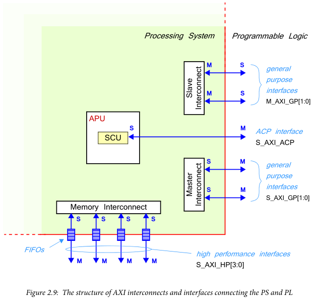
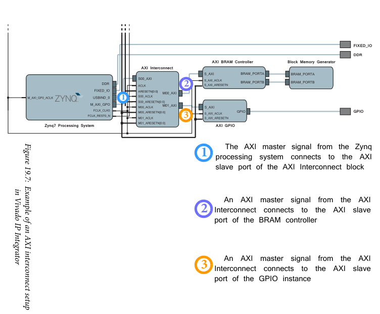
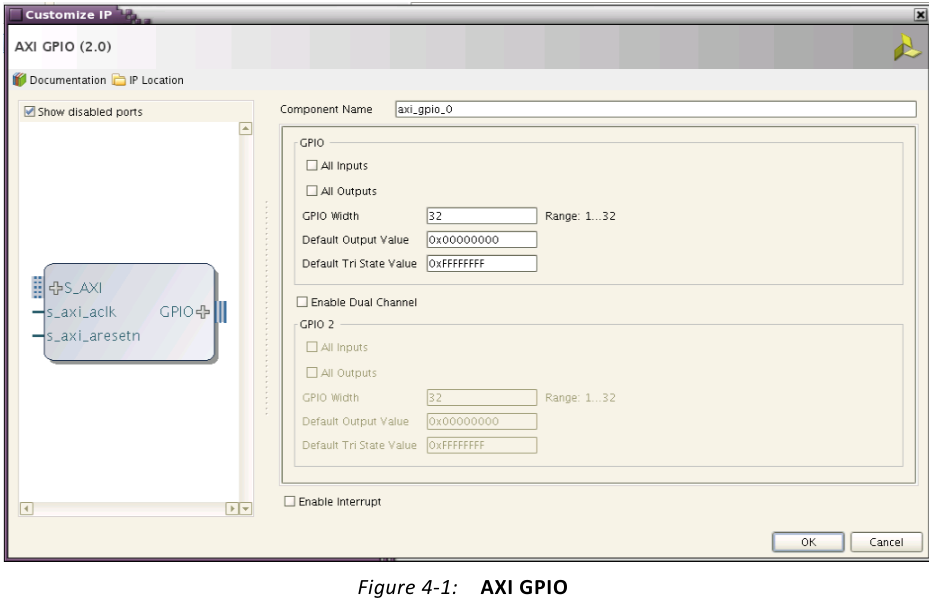

# Controlling the LEDs with AXI

One of the strengths of the Red Pitaya is that it incorporates both an FPGA, and a full Linux operating system. In this tutorial we'll learn how these two can communicate, allowing you to use the Linux terminal to control the FPGA, and read out data. As a demonstration, we'll control the LED lights on the side of the Pitaya.

The PS and PL communicate using *AXI*, a protocol used in many systems, not just the Red Pitaya. You can find an overview of the details [here](https://www.allaboutcircuits.com/technical-articles/introduction-to-the-advanced-extensible-interface-axi/), but most of the technicalities are taken care of by Vivado. You just need a general understanding to be able to use it, which is what we will focus on.

This tutorial is based on the [Xilinx AXI Documentation](https://docs.xilinx.com/v/u/en-US/pg144-axi-gpio), Chapters 2.3, 10, and 19 of [The Zynq Book](http://www.zynqbook.com/), and [‪Anton Potočnik's Stopwatch tutorial](http://antonpotocnik.com/?p=489265).

## Understanding AXI

The *Advanced eXtensible Interface (AXI)* is a common set of rules for transferring data. If a particular component, such as the ZYNQ7 Processing System, has an AXI port, you can transfer data to and from it without any knowledge of how the component works internally. You just use the standard AXI rules to ask for or send information, and the component will handle the rest.

### Red Pitaya's AXI ports

Let's begin by understanding the AXI ports on ZYNQ7 Processing System:


There are four AXI ports on the left: *S_AXI_HP0_FIFO_CTRL*, *S_AXI_HP0*, *M_AXI_GP0_ACLK*, *S_AXI_HP0_ACLK*, and one on the right: *M_AXI_GP0*.

* The naming convention *M_* or *S_* refers to the [*master/slave* terminology in communications](https://en.wikipedia.org/wiki/Master/slave_(technology)). The *master* controls the transfer, either sending or asking for data. The *slave* then takes or provides this data. For the ports denoted *M_* the Processing System is the master, while for the ports denoted *S_* the external FPGA is the master.
* *GP* stands for *General Purpose*, a way to easily transfer small amounts of data. This is what we will use here to control the LEDs. If we tried to transfer large amounts of data however, such as the signal coming through the analog to digital converters, these would not be fast enough.
* *HP* stands for *High Performance*. These ports are more complicated to use, but can transfer large amounts of data. We'll get to them in a later tutorial. These transfer data using things called [*FIFO buffers*](https://nandland.com/lesson-8-what-is-a-fifo/).
* The *0* on the end of *GP0* and *HP0* signify that this is the first port on the device. If the ZYNQ had a second high performance port, it would be called *AXI_HP1*.
* *ACLK* stands for *AXI Clock*. When two different components are communicating, they need to synchronise when they send and receive data. This is very difficult if they are using two different clocks. Thus these ports take the external clock signal to properly time the transfer. We will be interfacing the ZYNQ with FPGA code driven by *FCLK_CLK0*. Thus we will connect the *ACLK* to *FCLK*.

These ports are quite complicated. You'll notice that some of them have a + symbol. Click this to expand the port, and you'll see that it is made up of many different wires. Thankfully Vivado can handle these connections for us.

### How to exchange data


The protocol is *memory mapped*. This means an address is specified within the transaction, corresponding to an address in the system memory space. The master specifies the the address of the first word, and the slave calculates the addresses for the rest of the data words.

There are two types of connections:

* *Interconnects* operate within the PS. These manages and direct traffic between AXI interfaces.
* *Interfaces* allow for passing of data, addresses, and handshaking signals between master and slave clients within the system.

The structure is



* *Interconnects* act within the PS.

* 



*c.f.* Anton's setup


* *M_AXI_GP0* is the *General Purpose AXI*.
  * 32 bit data bus, suitable for low and medium rate communication between PL and PS.
  * 12-bit master port ID width
  * 6-bit slave port ID with
  * Master and slave port acceptance capability of 8 reads and writes.
  * Interface is direct, does not include buffering.
* *S_AXI_HP0*
  * High Performance Ports with read/write FIFOs.
  * 1kB data FIFO for buffering.

AXI write channel

1. Master sends address/control to slave.
2. Master sends data to slave.
3. Slave sends a write response back to the master.

AXI read channel

1. Master sends address/control to the slave.
2. Slave sends data back to the Master

* AXI allows out-of-order transactions.
  * Each transaction is given an identifying tag issued by the interconnect governing the order.

## AXI GPIO

* The *AXI GPIO* provides a general purpose input/output interface to an AXI4-Lite interface.
  * The Zynq's *M_AXI_GP0* plugs into an *AXI Interconnect*, which connects to an *AXI GPIO*.

### Data registers

* The *AXI GPIO* data register is used to read the general purpose input ports and write to the general purpose output ports.
  * When a port is configured as an input, writing to the data register has no effect.
* The GPIO data registers have predefined offsets
  * 0x0000 *GPIO_DATA* Channel 1 AXI GPIO Data register
  * 0x0008 *GPIO2_DATA* Channel 2 AXI GPIO Data Register

### Accessing GPIO core

- For input ports when interrupt is enabled
  1. Configure the port as input by writing the corresponding bit in the *GPIOx_TRI* register with 1.
  2. Enable the channel interrupt by setting the corresponding bit of the IP Interrupt Enable Register. Also enable the global interrupt, by setting bit 31 of the Global Interrupt Register to 1.
  3. When an interrupt is received, read the corresponding bit in the *GPIOx_DATA* register. Clear the status in the IP Interrupt Status Register by writing the corresponding bit with the value 1.
- For input ports where interrupt is not enabled.
  1. Configure the port as input by writing the corresponding bit in the *GPIOx_TRI* register with the value of 1.
  2. Read the corresponding bit in the *GPIOx_DATA* register.
- For output ports
  1. Configure the port as output by writing the corresponding bit in the *GPIOx_TRI* register with a value of 0.
  2. Write the corresponding bit in the *GPIOx_DATA* register.

### Vivado IP Core

- Insert an *AXI GPIO* core.
  - *Right-click -> Customise IP*



- *c.f.* Anton's, the Pitaya has two GPIO ports
  - one with both input and output, and the other just input.
- *All inputs* sets this GPIO channel bits in input mode only.
  - Similarly, *All outputs* sets the channel bits in output mode only.
- *GPIO Width* defines the width of the GPIO channel.
  - *Default output value* sets default values of enabled bits in this channel.
  - *Default tri state value*

- *Enable Dual Channel* enables a second channel *GPIO2*.
  - Unchecked by default.
- *Enable interrupt* enables interrupt control logic and interrupt registers in GPIO module.

### Traffic generator

- You can use the *AXI Traffic Generator* to generate AXI traffic.


## Red Pitaya

- See [Official documentation](https://redpitaya.readthedocs.io/en/latest/developerGuide/software/build/fpga/regset_common.html) for how AXI address is used by various apps.

## Implementing AXI

### Add GPIO Block

- Go to *Add IP*, choose *AXI GPIO*.
- *Right-click > customise*
  - Tick *Enable Dual Channel*
  - For channel 2, set *All Inputs*.

This will have three inputs:

- S_AXI
  - This manages the connection to the Zynq board.
  - If you click the plus, you can see this is many inputs grouped as one. Interfacing with a processor requires transmitting a lot of data.
- s_axi_aclk
- s_axi_aresetn

and two outputs:

- GPIO
- GPIO2

Connecting *S_AXI* to the Zynq processing system is quite complicated. Fortunately Vivado can automate this for us. 

- Click *Run Connection Automation* at the top.
- We just want to connect *S_AXI*, so tick that, and click continue.
  - This will create some new blocks.
    - *AXI Interconnect* between the PS and PL
    - *Processor System Reset*
  - It will wire everything together.

### Configure memory addresses

- We need to set the AXI GPIO core's memory address and range
  - We will access this from the Linux side.

- On the top of the window click on the *Address Editor* tab.

### Writing to memory with monitor

The Red Pitaya has a tool called *monitor* that you can use to read and write individual addresses, one bit at a time.
- [Official monitor documentation](https://redpitaya.readthedocs.io/en/latest/appsFeatures/command_line_tools/com_line_tool.html#monitor-utility)
- You can also read analog mixed signals, for example the Zynq temperature, power supply voltage, and other settings.

You can read an address using

```bash
redpitaya> monitor 0x40100014
0x00000001
```

You can write to an address via

```bash
redpitaya> monitor 0x40100014 0x8
```


**High-level scripts in Bash, Python, MATLAB can communicate with the FPGA using monitor**

- But don't be too blasé. The CPU algorithms also communicate with the FPGA through registers, so you might trip them up.

## Monitoring voltages with monitor

Monitor can also read voltage values on the extension connector.

- AIj/AOj are the Analog input and output connectors on E2
  - The analog output can be set using `sdac` switch

```bash
monitor -sdac 0.9 0.8 0.7 0.6
```

- VCCXXXX gives information about the power supply voltage source.

```bash
redpitaya> monitor -ams
#ID         Desc            Raw                 Val
0           Temp(0C-85C)    0x00000b12          75.670
1           AI0(0-3.5V)     0x00000008          0.014
2           AI1(0-3.5V)     0x00000017          0.039
3           AI2(0-3.5V)     0x00000008          0.014
4           AI3(0-3.5V)     0x00000006          0.010
5           AI4(5V0)        0x000004f9          3.800
6           VCCPINT(1V0)    0x0000055e          1.006
7           VCCPAUX(1V8)    0x00000995          1.797
8           VCCBRAM(1V0)    0x00000561          1.009
9           VCCINT(1V0)     0x00000561          1.009
10          VCCAUX(1V8)     0x00000997          1.798
11          VCCDDR(1V5)     0x00000806          1.504
12          AO0(0-1.8V)     0x0000000f          0.173
13          AO1(0-1.8V)     0x0000004e          0.900
14          AO2(0-1.8V)     0x00000075          1.350
15          AO3(0-1.8V)     0x0000009c          1.800
```


