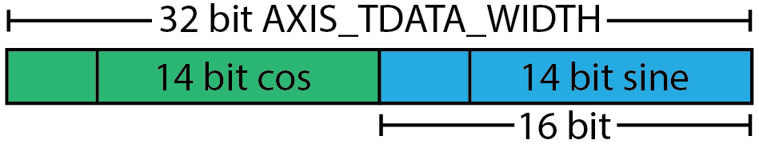

# Pavel's AXIS DAC Core

Here we'll go through Pavel Denim's [AXIS DAC Core v2](https://github.com/pavel-demin/red-pitaya-notes/blob/master/cores/axis_red_pitaya_dac_v2_0/axis_red_pitaya_dac.v), which converts an AXI Stream into a signal to send to the Pitaya's DAC output ports. You can download the Vivado file *axis_red_pitaya_dac.v* from this folder.

While the Red Pitaya has two fast analog outputs, there is only one pin in the Vivado model to send data to the DAC. Typically signals in the FPGA are sent on every rising edge of the clock signal from the Red Pitaya. The DAC however takes a [*Double Data Rate*](https://en.wikipedia.org/wiki/Double_data_rate) input, where signals are sent at double speed, with every rising and falling edge of the clock. The two signals for the DACs are combined into a single signal switching between them at double the clock speed. We create this combined signal using a *ODDR module*. Here we'll focus on how to use them, but more details are [here](/Tutorials/CORE_ODDR).

It will help to read our tutorial on [negative numbers in binary](/Tutorials/FPGA_NegativeBinary). The input to AXIS DAC core is assumed to be in two's complement binary, the most commonly used format for signed integers. DACs however take their input as offset binary. This core will therefore have to convert between the two.

## Inputs and outputs

The module begins with

```verilog
module axis_red_pitaya_dac #
(
  parameter integer DAC_DATA_WIDTH = 14,
  parameter integer AXIS_TDATA_WIDTH = 32
)
```

The `#()` after `module` defines [parameters](https://www.chipverify.com/verilog/verilog-parameters), which are just constants whose values we set at the start of the file. These are defined for convenience, and it will make it easier to change the code if you are using a Pitaya with a different DAC width, or want to handle data of a different size.

Next several inputs and outputs are defined.

The first set of inputs takes clock signals. These are all wires carrying a single bit.

```verilog
// PLL signals
input  wire                        aclk,
input  wire                        ddr_clk,
input  wire                        wrt_clk,
input  wire                        locked,
```

* `aclk` is the AXI clock signal.
* `ddr_clk` and `wrt_clk` are two clocks used by the DAC to time when it sends data. We just connect both of these to the 250MHz clock, and let the DAC handle the rest. If you want the details, they are in section 10.2.2 of the [DAC's data sheet](https://www.renesas.com/us/en/document/dst/dac1401d125-datasheet).
* `locked` connects to the `locked` signal from the *Clocking Wizard*, which tells us if the clock signal is valid or not. 

Next we have a set of outputs to the DAC:

```verilog
// DAC signals
(* X_INTERFACE_PARAMETER = "FREQ_HZ 250000000" *)
output wire                        dac_clk,
output wire                        dac_rst,
output wire                        dac_sel,
output wire                        dac_wrt,
output wire [DAC_DATA_WIDTH-1:0]   dac_dat,
```

* `dac_clk` and `dac_wrt` send `ddr_clk` and `wrt_clk` respectively to the DAC.
* `dac_rst` is a reset signal, which sets the DAC output to zero (see 10.2.2 of the [DAC's data sheet](https://www.renesas.com/us/en/document/dst/dac1401d125-datasheet)). The code will send this signal if the *Clocking Wizard* sends *locked=0*, or if the *AXIS* input signal is invalid.
* `dac_sel` selects which of the two DAC outputs the data should be sent to. The code will make this oscillate between 0 and 1 at 250MHz, so that both DAC outputs are active.
* `dac_dat` is a vector of length *DAC_DATA_WIDTH* which carries the data to the DAC. The reason for the '-1' is because a vector of length 14 is indexed [13:0].

* From the name `dac_clk`, Vivado infers that this output carries a clock signal. Vivado likes to know the lock frequency that this will carry, so we tell it that this will be 250MHz with the line `(* X_INTERFACE_PARAMETER = "FREQ_HZ 250000000" *)`. The code will work just fine if you remove this, however when you import the module Vivado will show a warning complaining that it doesn't know the clock speed.

Finally we have the wires which handle the *AXIS* connection, accepting data from the *Direct Digital Synthesiser*:

```verilog
// Slave side
output wire                        s_axis_tready,
input  wire [AXIS_TDATA_WIDTH-1:0] s_axis_tdata,
input  wire                        s_axis_tvalid
```

- `s_axis_tready` sends a signal to the *DDS* that this block is ready to accept data.
- `s_axis_tdata` accepts the data from the *DDS*.
- `s_axis_tvalid` carries the signal from the *DDS* that it's output data is valid.

These are standard names for an AXI port, so in the Block Diagram Vivado automatically groups these into *s_axis*.

##  Initial connections

The `s_axis_tdata` is 32 bits wide. Assuming it was created by the [sine wave tutorial](/Tutorials/IO_SignalGeneration), it will be laid out as



The *DAC_DATA_WIDTH* of 14 bits is [sign extended](https://en.wikipedia.org/wiki/Sign_extension) to 16 bits. The two signals put together give a *AXIS_TDATA_WIDTH* of 12 bits. 

The code creates two wires `int_dat_a_wire` and `int_dat_b_wire`, and connects these to the sine and cosine inputs, ignoring the sign extension bits.

```verilog
wire [DAC_DATA_WIDTH-1:0] int_dat_a_wire;
wire [DAC_DATA_WIDTH-1:0] int_dat_b_wire;

assign int_dat_a_wire = s_axis_tdata[DAC_DATA_WIDTH-1:0];
assign int_dat_b_wire = s_axis_tdata[AXIS_TDATA_WIDTH/2+DAC_DATA_WIDTH-1:AXIS_TDATA_WIDTH/2];
```

Wires are just connections, they don't store any data. You can think of *assign* as a physical connection, so that the relevant bits of `s_axis_data` flow automatically to the wires. Thus these two wires are just convenient ways to refer to the relevant bits of the *tdata* input.

## Create data registers

The *DDS* will send sine and cosine waves in time with `aclk`, which operates at at 125MHz. We need to write code that takes and saves these inputs, then sends them at 250MHz to the DAC.

We begin by defining some *registers*. Unlike wires which are simple connections, registers hold onto their data in-between assignments.

```verilog
reg [DAC_DATA_WIDTH-1:0] int_dat_a_reg;
reg [DAC_DATA_WIDTH-1:0] int_dat_b_reg;
reg int_rst_reg;
```

We next populate these registers each time `aclk` rises from 0 to 1:

```verilog
always @(posedge aclk)
begin
  if(~locked | ~s_axis_tvalid)
  begin
    int_dat_a_reg <= {(DAC_DATA_WIDTH){1'b0}};
    int_dat_b_reg <= {(DAC_DATA_WIDTH){1'b0}};
  end
  else
  begin
    int_dat_a_reg <= {int_dat_a_wire[DAC_DATA_WIDTH-1], ~int_dat_a_wire[DAC_DATA_WIDTH-2:0]};
    int_dat_b_reg <= {int_dat_b_wire[DAC_DATA_WIDTH-1], ~int_dat_b_wire[DAC_DATA_WIDTH-2:0]};
  end
  int_rst_reg <= ~locked | ~s_axis_tvalid;
end
```

Let's go through each of these parts in turn

```verilog
always @(posedge aclk)
```

An `always` block runs continuously, and `@(aclk)` means it will execute each time `aclk` changes. By writing `@(posedge aclk)`, this will execute each time `aclk` exhibits a positive edge, rising from 0 to 1.

```verilog
if(~locked | ~s_axis_tvalid)
  begin
    int_dat_a_reg <= {(DAC_DATA_WIDTH){1'b0}};
    int_dat_b_reg <= {(DAC_DATA_WIDTH){1'b0}};
  end
```

If the clock isn't locked, or if the *AXIS* data is invalid, we set the registers to be equal to zero. `1'b0` means a length-`1` binary equal to `0`. If we have a binary string `b`, writing `{n{b}}` creates `n` copies of `b`, for example `{3{2'b10}}` will result in `101010`. Thus `{(DAC_DATA_WIDTH){1'b0}}` will make a string of zeros 14 bits long.

```verilog
begin
  int_dat_a_reg <= {int_dat_a_wire[DAC_DATA_WIDTH-1], ~int_dat_a_wire[DAC_DATA_WIDTH-2:0]};
  int_dat_b_reg <= {int_dat_b_wire[DAC_DATA_WIDTH-1], ~int_dat_b_wire[DAC_DATA_WIDTH-2:0]};
end
```

If the clock signal is locked and the *AXIS* data valid, then we want to set our registers equal to waveforms. Our first instinct may be to write `int_data_a_reg = int_data_a_wire`. However this isn't quite right.

- We use `<=` rather than `=` to do a [*non-blocking assignment*](https://nandland.com/blocking-vs-nonblocking-in-verilog/). This means the two assignments are made in parallel. Since we are writing code to synthesise a circuit, this is the easiest thing to do. If you were to use an `=` (a *blocking assignment*), a more complicated circuit would be made that made sure the first assignment was always complete before the second.
- Recall from the [signal generation tutorial](/Tutorials/IO_SignalGeneration) that the *DDS* outputs data in two's complement binary, whereas the DAC takes offset binary as input. To switch between the two you just flip the leftmost bit. This would be done by `int_dat_a_reg <= {~int_dat_a_wire[DAC_DATA_WIDTH-1],int_dat_a_wire[DAC_DATA_WIDTH-2:0]}`, where `~` flips a bit and `{a,b}` joints two binary strings `a` and `b`. However, the DAC is set up so that a string of zeros corresponds to the maximum voltage and a string of ones to the minimum. We thus have to flip the number from positive to negative, which corresponds to keeping the leftmost bit, and flipping all the other bits.

```verilog
int_rst_reg <= ~locked | ~s_axis_tvalid;
```

Finally we have a register carrying the reset signal. If the clock isn't locked, or the *AXIS* data is invalid, this will be used to send a reset signal to the DAC.

## ODDRs for clock signals

We have two registers `int_dat_a_reg` and `int_dat_a_reg` which are populated with input data at a rate of 125MHz, in time with the rising edge of `aclk`. We want to convert this to *Dual Data Rate* output, sent at 250MHz in time with both edges of `aclk`. Generating and synchronising these signals is tricky, but Vivado has a module called *ODDR* which does that for us. For the details see [here]([/Tutorials/CORE_ODDR), but for our purposes all you need to know is:

* It has inputs `D1`,`D2` to take the individual data signals.
* There is an output `Q` carrying the DDR signal.
* It takes a clock `C` to time when data is sent to the *ODDR*.
* There are some extra inputs `CE`,`R`,`S` that can clear/reset it. We don't care about these, and can just set them to 1, 0, 0 respectively. 

The FPGA sends both data signals to the ODDR on the rising edge of *aclk*. The ODDR then sends one data signal on each edge of the clock. This mode of operation is called *SAME_EDGE*. (Alternatively it can run in *OPPOSITE_EDGE*, when the data signals are sent on each edge of the clock.)

The code first makes an *ODDR* to send the reset signal to the DAC:

```verilog
  ODDR #(
    .DDR_CLK_EDGE("SAME_EDGE"),
    .INIT(1'b0)
  ) ODDR_rst (
    .Q(dac_rst),
    .D1(int_rst_reg),
    .D2(int_rst_reg),
    .C(aclk),
    .CE(1'b1),
    .R(1'b0),
    .S(1'b0)
  );
```

There's a lot going on there, but just focus on `Q`, `D1`, `D2`, and `C`. The rest will be the same for all the blocks.

Next we set `dac_sel`, which tells the DAC which output we use. As before on every rising edge of `aclk`, two signals 1 and 0 will be delivered to the *ODDR*. This will then create a DDR output oscillating between 1 and 0 at 250MHz, rapidly switching between the two outputs. 

```verilog
  ODDR #(
    .DDR_CLK_EDGE("SAME_EDGE"),
    .INIT(1'b0)
  ) ODDR_sel (
    .Q(dac_sel),
    .D1(1'b1),
    .D2(1'b0),
    .C(aclk),
    .CE(1'b1),
    .R(1'b0),
    .S(1'b0)
  );
```

The next couple of blocks send `wrt_clk` and `ddr_clk` to the outputs `dac_wrt` and `dac_clk` respectively. Note that the output `Q` will oscillate between `D1`=1 and `D2`=0 at every edge of the given clock `C`. 

```verilog
  ODDR #(
    .DDR_CLK_EDGE("SAME_EDGE"),
    .INIT(1'b0)
  ) ODDR_wrt (
    .Q(dac_wrt),
    .D1(1'b1),
    .D2(1'b0),
    .C(wrt_clk),
    .CE(1'b1),
    .R(1'b0),
    .S(1'b0)
  );
```

```verilog
  ODDR #(
    .DDR_CLK_EDGE("SAME_EDGE"),
    .INIT(1'b0)
  ) ODDR_clk (
    .Q(dac_clk),
    .D1(1'b1),
    .D2(1'b0),
    .C(ddr_clk),
    .CE(1'b1),
    .R(1'b0),
    .S(1'b0)
  );
```


## ODDRs for data

Finally we create a DDR signal for the output data. The output `Q` on the *ODDR* only a single bit wide, thus we must create an *ODDR* for each of the fourteen bits. This is done using the  `for` loop below. Note that the loop variable `j`  must first be created by a `generate` statement.

```verilog
  genvar j;
  generate
    for(j = 0; j < DAC_DATA_WIDTH; j = j + 1)
    begin : DAC_DAT
      ODDR #(
        .DDR_CLK_EDGE("SAME_EDGE"),
        .INIT(1'b0)
      ) ODDR_inst (
        .Q(dac_dat[j]),
        .D1(int_dat_b_reg[j]),
        .D2(int_dat_a_reg[j]),
        .C(aclk),
        .CE(1'b1),
        .R(1'b0),
        .S(1'b0)
      );
    end
  endgenerate
```

Finally, we set `s_axis_tready` to `1`, telling the *DDS* that this block is always ready to accept input. 

```verilog
  assign s_axis_tready = 1'b1;
```

