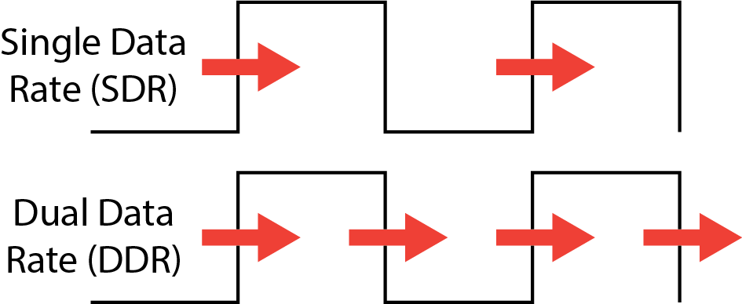
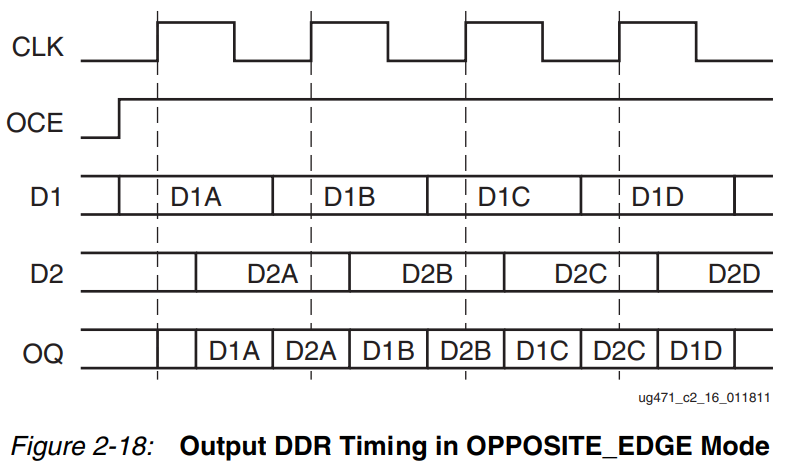
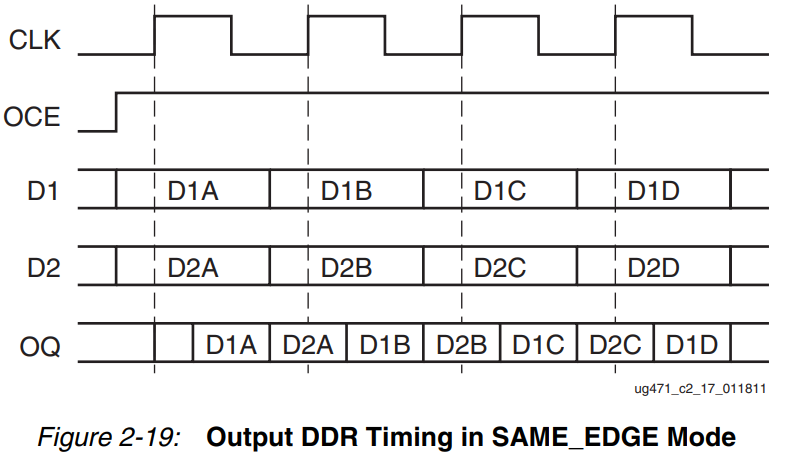

# ODDR for Dual Data Rate output

As described in the [Signal Generator tutorial](), the two Digital to Analog Converters (DACs) on the Red Pitaya are controlled by a single output on the FPGA. You must combine the signals into a single *Dual Data Rate* channel which switches between the two. In Verilog we do this using a construct called *ODDR (Output Dual Data Rate)*. In this section we'll describe what these are, and how to use them.

## What is Dual Data Rate?

The clock on an FPGA creates a signal which oscillates between zero and one at a constant rate. Typically data is transferred once per clock cycle, on the *rising edge* when the signal transitions from zero to one. In *Dual Data Rate (DDR)* however data is transferred on both the rising and falling edge:



The obvious advantage of DDR is that you can transfer twice the data in the same amount of time. Why not just double the clock signal? As discussed [here](https://electronics.stackexchange.com/questions/381825/why-use-ddr-instead-of-increasing-clock-speed), any physical wire has a [limit](https://electronics.stackexchange.com/questions/100155/bandwidth-and-wire-parameters) on how large a frequency it can carry, which limits the speed of the clock signal that can pass through it. However DDR is more complicated to design, and synchronisation is harder. Thus we use *ODDR* to create and manage the DDR signal.

## The ODDR block

The FPGA has dedicated logic to handle DDR output, called *ODDR*. This has inputs `D1`, `D2`, `CE`, `C`, `S`/`R`, and one output `Q`:


* `Q` is the Dual Data Rate output.
* `D1` and `D2` are the two Single Data Rate signals that we want to combine into DDR.
* `C` stands for clock. The *ODDR* needs the clock to time the output signals.
* `CE` stands for Clock Enable. Output will flow out of `Q` when `CE` is 1, and be disabled when `CE` is 0.
* `S`/`R` stand for Set and Reset. Setting `S`=1 forces the output to be 1, while setting `R`=1 forces the output to be 0. The two are combined because the ODDR will only have one of these.

For most applications we only care about the clock signal `C`, the two data inputs `D1`,`D2`, and the output `Q`. We can just set `CE=1`, `S=0`, `R=0`.

**Note that all inputs and outputs are only one bit in size**. The DAC on the Red Pitaya takes signals fourteen bits wide, so we will need to initialise fourteen *ODDRs* to carry this.

## Modes of operation

The ODDR can be used in two modes, depending on when the FPGA sends data to the ODDR.

* *OPPOSITE_EDGE*: The FPGA sends `D1` to the *ODDR* on rising edges, and `D2` on falling edges. This is the default.
* *SAME_EDGE*: The FPGA sends both data inputs to the *ODDR* only on the rising clock edges. This makes the the FPGA logic simpler and saves resources. The *ODDR* stores both signals, and releases DDR output through `Q`.

We can see this in Figures 2-18 and 2-19 in the [official documentation](https://docs.xilinx.com/v/u/en-US/ug471_7Series_SelectIO) (in these *OQ* refers to `Q`):





## Creating an ODDR in Verilog

You instantiate an *ODDR* block like you would any other module:

```verilog
ODDR ODDR_data(.Q(q_out), .D1(d1_in), .D2(d2_in), .C(clk), .CE(1'b1), .R(1'b0), .S(1'b0))
```

* *ODDR_data* is the name we've decided to give the module. This is arbitrary.
* The syntax `.Q(q_out)` connects the `Q` port of the *ODDR* to a wire *q_out* that you've defined in Verilog. Similarly for `D1`,`D2`,`C`.
* We have set `CE`, `R`, and `S` to static values of 1, 0, and 0 respectively, which ensure the *ODDR* will always transmit data. You can set these to some wires you've defined if you want to do something more complicated.

You can send extra options to the ODDR using a `#()` before the name. You can also add line breaks inside the brackets. In this example from [Pavel Denim's DAC code](https://github.com/pavel-demin/red-pitaya-notes/blob/master/cores/axis_red_pitaya_dac_v2_0/axis_red_pitaya_dac.v):

```verilog
ODDR #(
    .DDR_CLK_EDGE("SAME_EDGE"), 
    .INIT(1'b0)
) ODDR_data (
    .Q(q_out),
    .D1(d1_in),
    .D2(d2_in),
    .C(clk),
    .CE(1'b1),
    .R(1'b0),
    .S(1'b0)
)
```

* The *ODDR* has been set to `SAME_EDGE` mode.
* The *ODDR* will be initialised in the 0 state.

## Generating multiple ODDRs

In [Pavel Denim's DAC](https://github.com/pavel-demin/red-pitaya-notes/blob/master/cores/axis_red_pitaya_dac_v2_0/axis_red_pitaya_dac.v), we have two 14-bit registers `int_data_a_reg` and `int_data_b_reg` that we want to encode into a DDR output `dac_dat`. Since each *ODDR* is one bit long, we have to use a `for` loop to initialise an *ODDR* for each bit.

The syntax for this is:

```verilog
genvar j;
generate
    for(j = 0, j < 14, j = j+1)
    begin : DAC_DAT
      ODDR #(
        .DDR_CLK_EDGE("SAME_EDGE"),
        .INIT(1'b0)
      ) ODDR_inst (
        .Q(dac_dat[j]),
        .D1(int_dat_b_reg[j]),
        .D2(int_dat_a_reg[j]),
        .C(aclk),
        .CE(1'b1),
        .R(1'b0),
        .S(1'b0)
      );
    end
endgenerate
```

* You have to use `genvar` to initialise a loop variable.
* We loop over each bit, initialising a new `ODDR_inst` and connecting the `int_data_` register bits to the `D1`/`D2` ports, and `dac_dat` to `Q`.
* The line `begin : DAC_DAT` gives a name `DAC_DAT` to the loop. This won't change the loop's behaviour, so you could omit it. However if you want to simulate this, all of your initialised `ODDR_inst` blocks will be grouped together under `DAC_DAT`.

For more on creating blocks using `for` loops see this [ChipVerify post on `generate`](https://www.chipverify.com/verilog/verilog-generate-block).

## Further reading

* [This stackexchange post](https://electronics.stackexchange.com/questions/381825/why-use-ddr-instead-of-increasing-clock-speed) has a detailed discussion on the pros and cons of doubling the clock speed vs using DDR.
* [This ZipCPU post](https://zipcpu.com/blog/2020/08/22/oddr.html) follows someone trying to build their own *ODDR*, and all the challenges this entails.

- The Xilinx documentation on *ODDR* can be found in pages 126-133 of the [7-series FPGAs SelectIO Resources User Guide UG471](https://docs.xilinx.com/v/u/en-US/ug471_7Series_SelectIO).