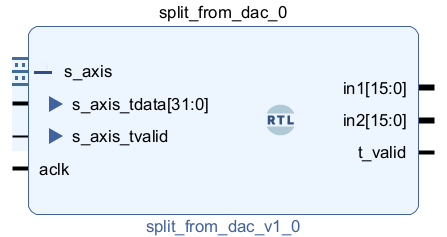
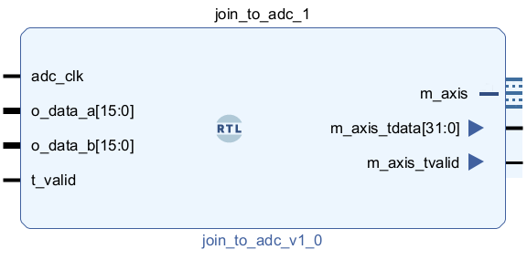

# Cores for splitting and joining AXIS data

Here we'll describe in detail the Verilog code used to split and join the data from the digital to analog converters. The ports on these blocks and their behaviours are described in the [splitting and joining tutorial](/Tutorials/PROJ_IOSplittingJoining). You can download both modules `split_from_adc.v` and `join_to_dac.v` from this folder.

## split_from_adc

The code in `split_from_adc.v` splits the AXI stream from Pavel Denim's *axis_red_pitaya_adc* into two 16 bit wires carrying the two inputs to the Red Pitaya.



### Code

The code begins with two parameters which will be specify how many bits the input and output wires will be. Parameters are just constants that we can reference later on in the code. These can make the code more readable, and allow for easy modification if we want to adapt the code to different data sizes. 

* `PADDED_DATA_WIDTH` is the number of bits in the [sign extended](/Tutorials/FPGA_NegativeBinary) individual inputs, which is 16 bits. For the STEMLab-14 this will be fourteen bits of data and two padding bits, while for the STEMLab-16 this would be sixteen bits of data.
* `AXIS_TDATA_WIDTH` is the size of the data coming out of the DAC. Since this is two combined inputs, it must be twice the padded data width.

```verilog
module split_from_dac #
(
  parameter integer PADDED_DATA_WIDTH = 16,
  parameter integer AXIS_TDATA_WIDTH = 32
)
```

The block has three input wires for the AXIStream. `s_axis_tdata` is thirty-two bits long and contains the data from the two input channels. There is also a clock signal `aclk`, and a `s_axis_tvalid` signal to say when data is valid. The clock and data signal vary at 125MHz, which we tell Vivado using the *X_INTERFACE_PARAMETER* line.

```verilog
(* X_INTERFACE_PARAMETER = "FREQ_HZ 125000000" *)
input wire	aclk,

(* X_INTERFACE_PARAMETER = "FREQ_HZ 125000000" *)
input wire [AXIS_TDATA_WIDTH-1:0] s_axis_tdata,

input wire	s_axis_tvalid,
```

The block has two sixteen bit outputs for the two input channels: `in1` and `in2`. The two will both be valid or invalid at the same time, so we only need a single `t_valid` signal.

```verilog
(* X_INTERFACE_PARAMETER = "FREQ_HZ 125000000" *)  
output wire [PADDED_DATA_WIDTH-1:0] in1,

(* X_INTERFACE_PARAMETER = "FREQ_HZ 125000000" *)
output wire [PADDED_DATA_WIDTH-1:0] in2,

output wire t_valid
```

The input `s_axis_tdata` may not always be valid. When `s_axis_tvalid` is false, we need to hold the previous input values until new valid data is provided. Wires don't store anything, they just connect different objects together. We therefore need two *registers* to hold the values of each input.

```verilog
reg  [PADDED_DATA_WIDTH-1:0] in1_reg;
reg  [PADDED_DATA_WIDTH-1:0] in2_reg;
```

Each clock cycle, if `s_axis_tvalid` is 1, we update both registers with the relevant bits from `s_axis_tdata`.

* `always @(posedge aclk)` means the block will run every time `aclock` ticks from 0 to 1, i.e. once each clock cycle.
* The `<=` is *non-blocking assignment*, which means both `in1_reg` and `in2_reg` will be updated simultaneously.

```verilog
always @(posedge aclk)
begin
	if(s_axis_tvalid)
	begin
    	in1_reg <= s_axis_tdata[15:0];
    	in2_reg <= s_axis_tdata[31:16];
	end
end
```

Finally, the output wires `in1` and `in2` are connected to the two registers. Since these always hold valid values, we can just set `t_valid` to be always 1.

```verilog
assign in1 = in1_reg;
assign in2 = in2_reg;

assign t_valid  = 1'b1;
```

## join_to_dac

In `join_to_dac.v` we join two sixteen-bit signals into a single AXI Stream to send to Denim's *axis_red_pitaya_dac*. 



### Code

We have two parameters as before, specifying the sizes of the individual and combined data.

```verilog
module join_to_adc #
(
  parameter integer PADDED_DATA_WIDTH = 16,
  parameter integer AXIS_TDATA_WIDTH = 32
)
```

We have five input wires. `aclk` is a clock signal, and `out1`,`out2` contain the signals to send to the two output ports. Since these could have been processed differently, these have two individual signals to specify when they are valid.

```verilog
(* X_INTERFACE_PARAMETER = "FREQ_HZ 125000000" *)
input wire aclk,

(* X_INTERFACE_PARAMETER = "FREQ_HZ 125000000" *)  
input wire [PADDED_DATA_WIDTH-1:0] out1,
(* X_INTERFACE_PARAMETER = "FREQ_HZ 125000000" *)
input wire [PADDED_DATA_WIDTH-1:0] out2,

input wire out1_valid,
input wire out2_valid,
```

The output of the block is a single AXI stream, containing a standard thirty-two bit `m_axis_tdata`, and a `m_axis_tvalid` signal.

```verilog
//Joined output data
(* X_INTERFACE_PARAMETER = "FREQ_HZ 125000000" *)  
output wire [AXIS_TDATA_WIDTH-1:0] m_axis_tdata,
output wire m_axis_tvalid
```

As in the splitting block, we will use two registers to hold the values of the output data in-between getting valid inputs.

```verilog
reg  [PADDED_DATA_WIDTH-1:0] out1_reg;
reg  [PADDED_DATA_WIDTH-1:0] out2_reg;
```

Each clock signal we update the registers. This is done separately, with each register being updated only if its corresponding *valid* signal is 1.

```verilog
always @(posedge aclk)
begin
    if(out1_valid)
    begin
        out1_reg <= out1[PADDED_DATA_WIDTH-1:0];
    end
    if(out2_valid)
    begin
        out2_reg <= out2[PADDED_DATA_WIDTH-1:0];
    end
end
```

The thirty-two bit output wire `m_axis_tdata` is connected to the two registers, with `out1_reg` occupying bits 0 to 15, and `out2_reg` bits 16 to 31. Since the registers hold their values in-between getting valid inputs, the output from the joining block will always be valid, so we set `m_axis_tvalid` to always be 1.

```verilog
assign m_axis_tdata = {out2_reg[PADDED_DATA_WIDTH-1:0],out1_reg[PADDED_DATA_WIDTH-1:0]};
assign m_axis_tvalid = 1'b1;

```

