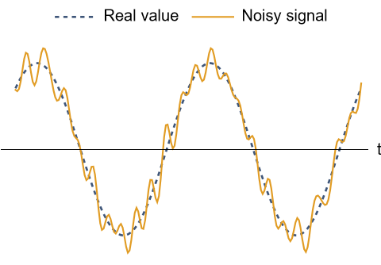
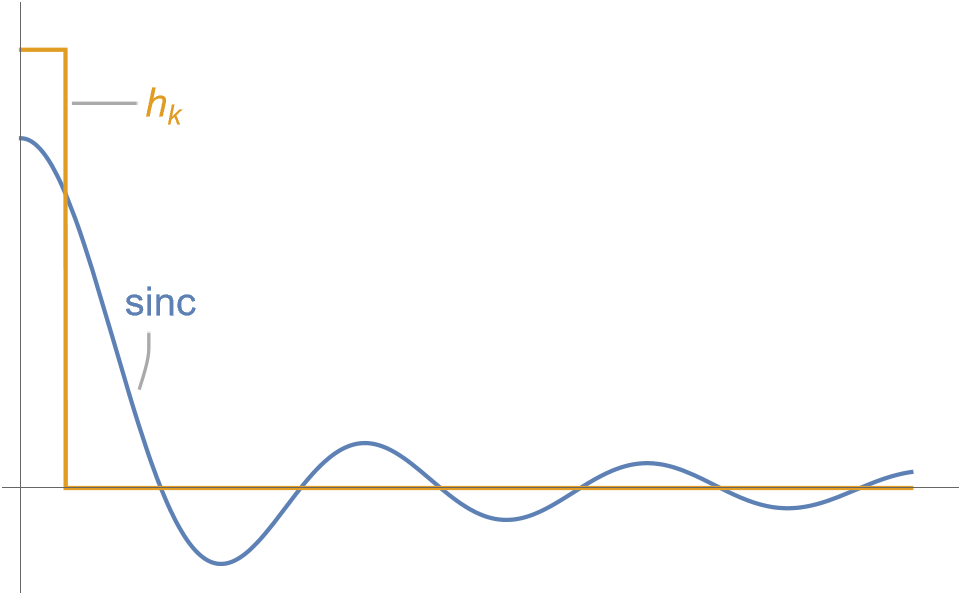
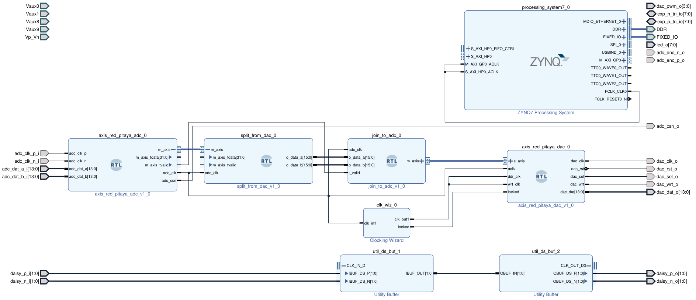
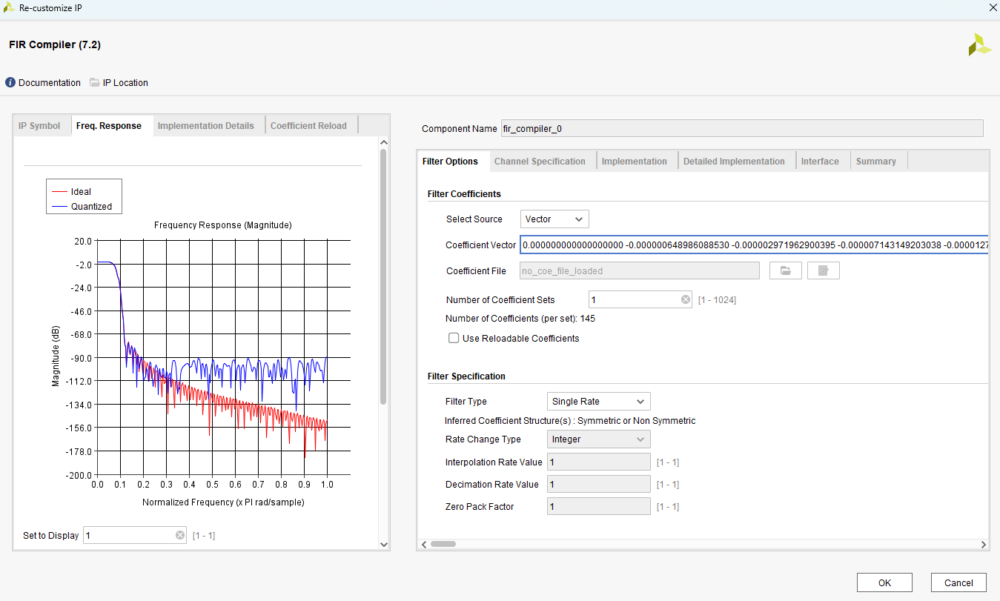
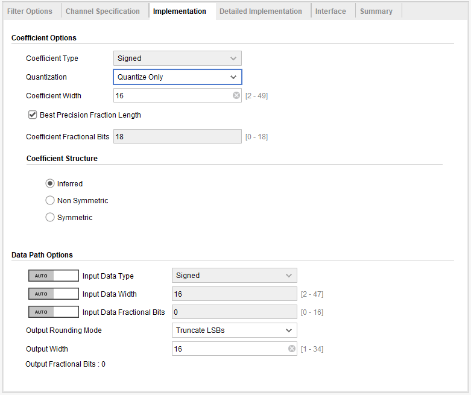
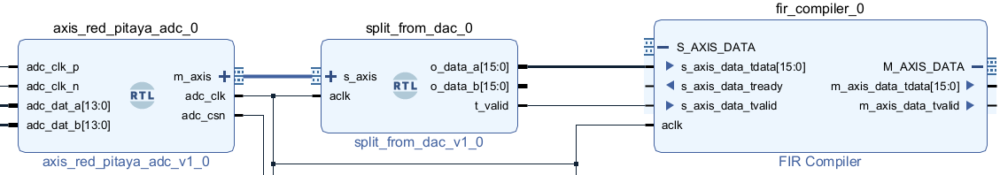
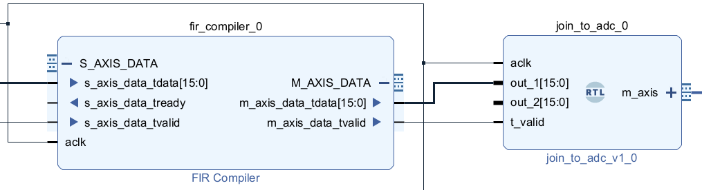
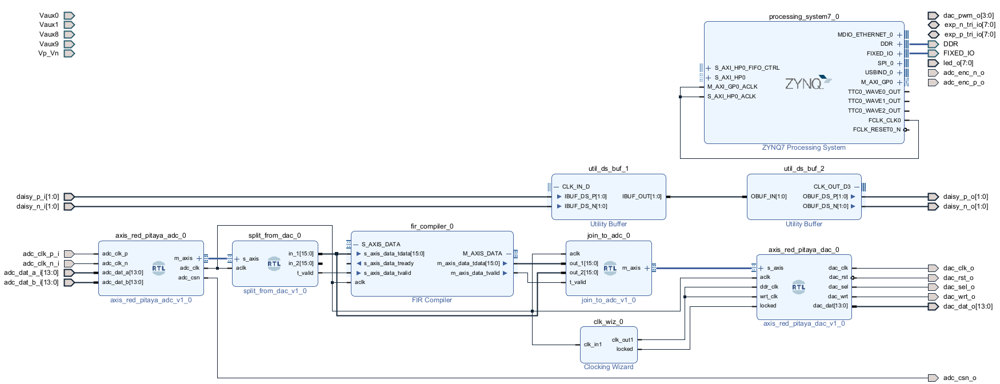

# Simple FIR filter

In this tutorial we'll learn how to implement a simple digital filter on the Red Pitaya. We will work with *Finite Impulse Response (FIR)* filters, where the filtered output at time $t$ is a linear combination of values of the input signal at previous times. These are the simplest kind of digital filter, but they are versatile enough to do most of the kinds of signal processing that you may want to do in the laboratory.

FIR filters work by summing linear combinations of the current and previous values of the signal. For this to work, they need to hold in memory previous values of the signal, up to several periods of the frequencies of interest. Since the Red Pitaya samples at 125 MHz, this means that a simple FIR filter will only be able to operate at megahertz frequencies, since anything much slower would require the FPGA to store and then performing mathematical operations on vast amounts of data. To operate at lower frequencies it is necessary to first downsample the data, which we cover in [ADD THIS]().

We'll give only a brief introduction to FIR filters. Before going through this tutorial, you should first go through [Feeding an input signal through to the output](/Tutorials/PROJ_IOFeedthrough). To test out your filter you'll need an oscilloscope and signal generator.

## Preliminaries

### Filtering

When we measure a signal in a laboratory, there will often be unwanted noise corrupting our signal. With filtering we aim to remove (or 'filter out') this noise, and recover the original signal. We are able to do this because most of the time our signal of interest will occur at a different frequency range to the noise. Thus a filter can be thought of as something that amplifies certain frequencies, and suppresses others.

One way to filter an electrical signal is to design an electrical circuit out of basic components such as resistors, capacitors, and inductors. This is an *analogue filter*. When a continuously-varying electrical signal passes through the circuit, the output will be a filtered version of the input. On the Red Pitaya however we have a digital representation of our signal, as a sequence of 1s and 0s that changes every clock cycle. A *digital filter* is a series of mathematical operations that we apply to the current and past values of the signal, whose output will be a filtered version of the original. 

One of the great things about digital filtering is that it is programmable. If you want to change the frequency ranges of the filter, you don't need to go out and buy different capacitors, you can just change some code in Vivado.

A filter depends very heavily on the sampling rate of the data $f_s$. The fastest frequency that is available is the Nyquist frequency, given by $f_s/2$. 

### FIR filters

The simplest kind of digital filter is called *Finite Impulse Response (FIR)*. These are so-called because if you turn off the input signal, the filter output will eventually go to zero. In this section we'll give a brief introduction, for more see  based on chapter 5 of [Understanding Digital Signal Processing by Richard Lyons](https://www.amazon.com/Understanding-Digital-Signal-Processing-3rd/dp/0137027419), if you want more details take a look at the textbook.

Suppose you are measuring a signal oscillating at 1Hz, corrupted by rapidly-oscillating noise represented by faster oscillations:

How can we clean out the noise, using simple mathematical operations that the FPGA can perform quickly? One simple answer is to take a moving average of the noisy signal. If we are sampling at 100Hz, averaging every five or ten points. The noise, which oscillates very quickly between positive and negative values, should average out. On the other hand our slowly-varying signal won't change appreciably over ten samples, so should be unaffected by the averaging. Doing this gives us the plot below:

We can see that the average cleans the noise out of our signal, and using more points gives us better performance. The moving average is thus a filter we can use to clean out our data. It gets rid of high frequencies, thus is a *low-pass filter*.

Let's think about how a low-pass filter is represented mathematically. Suppose we average over the past $n$ samples. Let $x_j$ represent the $j$th measured value, and $y_j$ be the $j$th output of the filter. Then for $j=7$ and $n=5$ we have

$$y_7=\frac{x_7+x_6+x_5+x_4+x_3}{5},$$

and in general:

$$y_j=\sum_{k=0}^n\frac{x_{j-k}}{n}.$$

As we can see, the filter is just a series of multiplications and additions, which can be easily implemented by the digital logic on the FPGA.

Let's write this a general way that can be extended to describe many filters. Define $h_j$ to be $1/n$ when $0\le k\le n$, and $0$ for $k>n$. Then we can write the filter as:

$$y_j=\sum_{k=0}^{\infty}h_kx_{j-k}.$$

This is the general formula for any Finite Impulse Response filter. Let's digest it a bit:

* The function $h_k$ is called the *kernel* of the filter, and expresses how the filtered output at a time $j$ depends on the value of the signal at time $j-k$. 
* For $k$ larger than some cut-off ($n$ in the case of the moving average) all $h_k$ should be zero. The FPGA can only hold a finite number of samples in memory.
* $h_k$ is also the *impulse response* of the filter. If $x_0=1$ and all other $x_{j>0}$ are zero, then the filter output will be $y_k=h_k$. Since $h_{k}=0$ when $k>n$, the impulse response will always end after finite time - the filter has Finite Impulse Response.
* The values of $h_k$ are also called the *coefficients* of the FIR filter.

Let's look again at the FIR filter equation:

$$y_j=\sum_{k=0}^{\infty}h_kx_{j-k}.$$

Mathematically, this expresses that the filtered output $y_j$ is the *convolution* of the input $x_j$ with the kernel $h_j$. If you know a bit of Fourier theory, this says that the Fourier transform of $y_j$, is equal to the *product* of the Fourier transforms of $x_j$ and $h_j$. Thus an appropriate kernel lets us perform surgery in Fourier space, cutting out or boosting different frequencies.

Thinking back to the moving average, the kernel was a rectangle function, whose Fourier transform was a sinc function. Let's plot these:

The sinc function, when used to multiply the Fourier transform of our input signal $x_j$, will keep frequencies closest to the origin. The moving average does indeed act as a low-pass filter. However, we can also see from this that it isn't perfect. The sinc has ripples, so not all frequencies are evenly suppressed. Moreover it isn't very flat near the origin, and drops off very slowly. If our signal is comprised of multiple low frequencies, these will also be suppressed by different amounts, distorting our measurement. 

In fact, we want the Fourier transform of our kernel to be the rect function, which will keep all frequencies below some point and suppress all others, without any distortion. Thus our kernel $h_j$ should be a sinc function! However in practice since $h_j$ can only be non-zero for finitely many $j$, we will have to truncate the $\mathrm{sinc}$ function at some point, which will corrupt its Fourier transform away from a perfect rectangle. We often choose something other than a 

Choosing kernels can be a complicated affair. Depending on your requirements, you may care about how sharply the filter falls to zero, how flat it is, how many coefficients your FPGA hardware will let you have in your $h_j$, and many more things besides. For simple applications however you don't have to worry too much. There are many pre-made calculators both online and in programming languages like Python and MATLAB where you can just say that you want a low/high/band-pass filter and what the cut-offs should be, and they will give you a kernel $h_k$ that is good enough.

### Truncating LSBs

The filter works by adding together linear combinations of values of the input at different times. Depending on the filter coefficients you choose, it is possible for the output to thus be longer than a 16 bit number.

The filter works by adding together linear combinations of values of the input at different times. Depending on the filter coefficients you choose, it is possible for the output to thus be longer than a 16 bit number. The *Output Rounding Mode* tells Vivado how to handle these extra bits. 

We only care about the lowest 14 bits. If the signal gets bigger the DAC will be fed gibberish. But this shouldn't be a problem for filters with a gain of 1.

## Block design

Begin by creating the block design from [splitting and joining AXIS data](/Tutorials/PROJ_IOSplittingJoining). Make sure you remember to *Generate Output Products* and *Create HDL Wrapper*.

### Design an FIR Filter

We need to choose a kernel for our filter, represented by a set of coefficients. There are many programs that we can use to to calculate these. MATLAB provides a sophisticated interface which we'll eventually get to using, but for now let's use the website [fiiir.com](https://fiiir.com/).

* The first thing is to decide what type of filter to use. Let's use a bandpass filter, which allows only frequencies within a certain range. 
* Next the filter needs to know the sampling rate, which is 125MHz, or 125000000 Hz. 
* We now need to choose the frequencies for the bandpass. Since our sample rate is megahertz, these all have to be within the megahertz range. 
  * The cutoff frequency $f_L$ is the low end of the bandpass, let's take 2MHz=2000000Hz.

  * The transition bandwidth $b_L$ is how wide the filter is after the cutoff. We'll set this to 1MHz=1000000Hz, though the calculator may change this.

  * The cutoff frequency $f_H$ is the high end, lets take 4MHz=4000000 Hz.

  * We again must choose a transition bandwidth $b_H$, let's make this 1MHz=1000000Hz. Again this may be changed by the calculator.

* Finally there's the type of window. You can look into this for more details, for now leave it as default.

Press *Compute Filter*. You might notice that the transition bandwidth changes. This is because this depends on what filter can be computed.

Below you'll see a graph of the Filter Characteristics. You should notice the frequency response has a gain of 1 between 2 and 4MHz, and 0 otherwise. The impulse response will look something like a deformed sinc.

Scrolling down, you'll under *Filter code* a list of numbers. These give you the filter coefficients, the values $h_k$ for the filter. Vivado can take up to 1024 of these, so hopefully there's less than that. Right-click and copy these.

### FIR compiler block

#### Input coefficients

The Vivado block that implements an FIR filter is called the *FIR Compiler*. Add one of these to the design. Double click to edit this. Paste the filter coefficients into the *Coefficient Vector* box. On the left, click on the *Freq. Response* tab, and it will visualise the gain of the filter.

* The red *ideal* line shows the response if the filter coefficients were implemented exactly. In reality however we must represent these decimals as a binary number string in FPGA, a process called *quantization*. The performance of the filter after quantization is shown by the blue *Quantized* curve.
* The units of the vertical axis are in *Normalized Frequency*. On this, $1.0$ represents the Nyquist frequency $f_s/2=125\mathrm{MHz}/2=62.5\mathrm{MHz}$. The low-frequency cutoff here is $0.037$, which corresponds to $0.037\times62.5\mathrm{MHz}\approx 2.5\mathrm{MHz}$.

#### Implementation

Now click on the *Implementation* tab. Under *Coefficient Options* tick *Brest Precision Fraction Length*, which means Vivado will figure out how many bits to use to represent the FIR coefficients when doing its internal maths.

Next we need to think about how big the input and outputs of the filter are. 

The inputs to the filter should be a 16 bit vector. Recall that this is a 14 bit input from the DAC, with two padding bits. This means that *Input Data Width* should be 16, which is the default.

The filter works by adding together linear combinations of values of the input at different times. Depending on the filter coefficients you choose, it is possible for the output to thus be longer than a 16 bit number. The *Output Rounding Mode* tells Vivado how to handle these extra bits. By default this is set to *Full Precision*, which means Vivado will automatically choose a very large output size. However, we know that our filter coefficients have a gain of 1, which means that the output should never be larger than the input data size. Thus set the *Output Rounding Mode* to *Truncate LSBs*, which will truncate the least significant bits to a fixed size, and set the *Output Width* to 16.

Leave all other settings as default, and click *OK*.

### Connect blocks

First, disconnect the three connections between the *split_from_dac* to *join_to_adc* (*o_data_a[15:0]*, *o_data_b[15:0]*, and *t_valid*). We want to filter the data before it is sent to the ADC. Expand both *S_AXIS_DATA* and *M_AXIS_DATA* on the *FIR*, since we'll be connecting the individual wires separately.

Let's do the inputs to the FIR compiler first. Expand *s_axis_data* input on the FIR compiler. We can see that this block takes three input signals, which we will connect to outputs on *split_from_dac*.

* *s_axis_data_tdata[15:0]*, the input data to be filtered. Connect this to *o_data_a[15:0]* from *split_from_dac*.
* *s_axis_data_tvalid*, a signal which tells it whether the time data is valid or not. Connect this to *t_valid* from *split_from_dac*.
* *aclk*, the clock signal. Connect this to *adc_clk* from the DAC *axis_red_pitaya_adc*.

There is also a port *s_axis_ready*, which is an output. This tells whatever block is sending the signal whether or not the filter is ready to receive it. We won't bother with this, and will just send data regardless. This should look like below:

Now let's connect the filter outputs to *join_to_adc*. Connect *m_axis_tdata[15:0]* to *o_data_a[15:0]*, and *m_axis_tvalid* to *t_valid*:

So, data going through *IN1* on the Red Pitaya will now be filitered, and the result sent through *OUT1*. What should we send through *OUT2*? Rather than just passing through the data from *IN2*,let's send the unfiltered data from *IN1* through *OUT2*, so we can compare the two on the oscilloscope. Connect *dac_in1* to *adc_out2*. This will give you the final block design:

## What's next?

- A good reference on digital filtering is [Understanding Digital Signal Processing by Richard Lyons](https://www.amazon.com/Understanding-Digital-Signal-Processing-3rd/dp/0137027419).
- In this tutorial we made a low-pass filter. Try and make a high-pass or bandpass.
- In this tutorial we used FIR filters.  More advanced filters (*Infinite Input Response*) use feedback to achieve better performance. In certain circumstances this feedback can lead to the output continuing for ever after the input signal stops. 