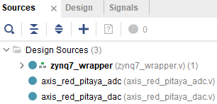
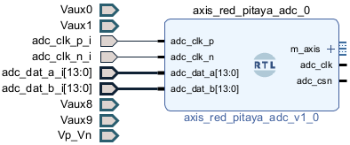
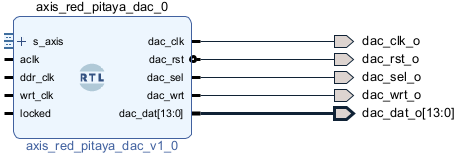
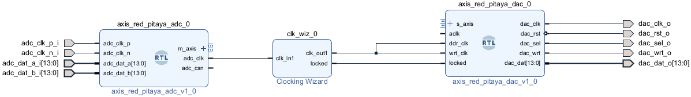
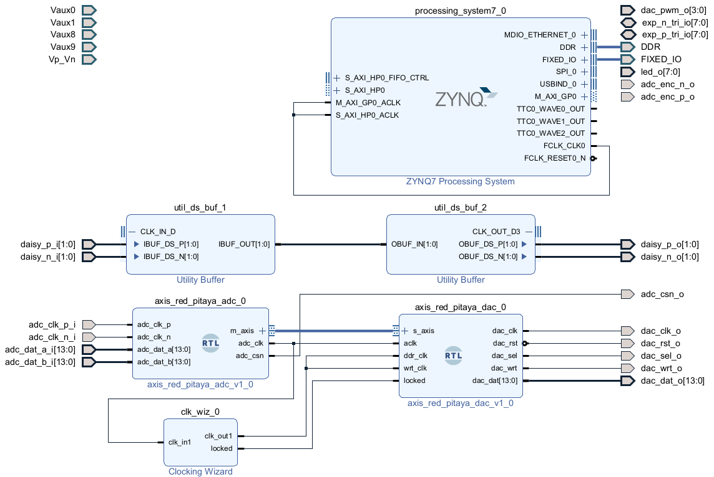

# Feeding through a signal

In the [sine wave tutorial](/Tutorials/PROJ_IOSignalGeneration) we generated outputs from the fast DACs on the front of the Pitaya. We'll now learn how to use the analog inputs. As an example, we'll make a simple feedthrough that takes in data through the ADC inputs, and passes them straight through to the DAC outputs.

To interface with the analog ports, we'll use slightly modified versions of [Pavel Denim's ADC and DAC cores](https://github.com/pavel-demin/red-pitaya-notes/tree/master/cores). These are described by the Verilog files `axis_red_pitaya_adc.v `  which you can download from this folder `axis_red_pitaya_dac.v`. You can use them just fine as "black boxes", but we recommend eventually checking out the details of how they work, given [here for the DAC](/Tutorials/CORE_DAC_AXIS) and [here for the ADC](/Tutorials/CORE_ADC_AXIS).

## Block design

Begin with the [base Vivado setup](/Tutorials/SETUP_BaseCode). Then *Generate Output Products* and *Create HDL Wrapper* for your block design.

### Add sources

On the left sidebar under *Project Manager* select *Add Sources*. 

Choose the *Add or create design sources* radio button and press *Next*. Then use the *Add Files* button to add both Verilog files. Under *Sources* you should now see:

The wrapper for your block design should be bold. If it isn't, *Right Click -> Set as Top*.

### Add blocks

We want to add the ADC and DAC blocks to the design. You can either *Right Click* a blank spot of the the Block Design and choose *Add Module*, or more simply drag and drop the modules from *Design Sources* onto the canvas.

Connect the input ports on the *adc* to the matching pins from the ADC:

Similarly, connect the output ports on the *dac* to the matching DAC pins:

*m_axis* will be a 32 bit vector, the first 16 bits of which correspond to the first analog input, and the second 16 bits the second analog input. Similarly *s_axis* expects a 32 bit vector, the first half will be sent to the first analog output and the second half to the next.

For the STEMLab-14, the ADC and DAC have a size of 14 bits. The ADC inputs are padded to 16 bits to be a whole number of bytes, and you can process them with Verilog modules as if they were 16 bit numbers. When you send them to the DAC however the leftmost two bits will be ignored.

### Clock signal

Previously we used the *FCLK_CLK0* signal to time our design. However since we are using the Analog to Digital Converter, we should use its clock signal to make sure everything is in sync.

As in the [signal generation tutorial](/Tutorials/PROJ_IOSignalGeneration), we need to create a double frequency clock signal for the DAC. As described there, add a *Clocking Wizard* IP, set the input frequency to 125MHz, the output frequency to 250MHz, and disable the *reset* input.

Connect the *adc_clk* output from the ADC to the input *clk_out1* on the *Clocking Wizard*. Then connect the *clk_out1* and *locked* outputs from the *Clocking Wizard* to the *ddr_clk*, *wrt_clk*, and *locked* inputs on the *dac*:

### Connect the data

Make a connection between the *m_axis* output on the *adc* to the *s_axis* input on the *dac*. 

If you expand *m_axis*, you will see that this has two outputs *tdata* and *tvalid*. *s_axis* has inputs *tdata* and *tvalid*, but also an output signal *tready*. Vivado is smart enough to automatically match the ports, and disregard the *tready* port which isn't present on *m_axis*. If we were doing advanced applications we may want to take *tready* into account, but for simple feedback we don't need to worry about this.

After doing this you should have the full block diagram:

That's it! Try it out and check that it works.

## What's next?

If you want to design a feedback system, you can add scaling, filtering, and a time delay to the signal before it's sent to the DAC. You could even make this controllable through the Linux operating system with [GPIO](/Tutorials/PROJ_LEDAXI).