# Generating a sine wave

In this tutorial we'll see how to generate a sine wave from the Red Pitaya's high speed analog outputs. FPGAs are digital devices, working with ones and zeros. However a sine wave is an analog concept, represented by a voltage. The Pitaya generates analog output using high-speed Digital to Analog Converters (DACs), which take fourteen-bit binary numbers, and output a voltage. To generate a digital signal which rises and falls like a sine wave, we use a *Direct Digital Synthesiser (DDS)*, a common component in FPGAs.

There is a quirk to using the DACs. Externally there are two high-speed DAC outputs, but internally the Red Pitaya only has a single output pin. We take two digital signals, and combine them using [Pavel Denim's DAC core](https://github.com/pavel-demin/red-pitaya-notes/blob/master/cores/axis_red_pitaya_dac_v2_0/axis_red_pitaya_dac.v) into a single channel oscillating between these at twice the clock frequency. The DAC then uses this this *Dual Data Rate* signal to drive its two outputs.

## Preliminaries

### Direct Digital Synthesisers (DDS)

A *Direct Digital Synthesiser (DDS)* is a component used for generating sine waves, i.e. $\sin(\phi)$. As an input it takes either the phase $\phi$ of the wave, or a clock signal which can be used to generae the phase. It then uses a lookup table (a list of which amplitudes correspond to which phases) to output a sine wave (see [this AnalogDialogue article](https://www.analog.com/en/analog-dialogue/articles/all-about-direct-digital-synthesis.html) for more details on how they work). One nice thing about *DDSs* is that they let you vary the frequency of the wave quickly and continuously. All you have to do is speed up or slow down the rate at which the input phase $\phi$ changes.

The output of a *DDS* is an integer oscillating sinusoidally between its minimum and maximum values. The number of bits in the output is called the *Output Width*, which corresponds to the resolution of the wave being generated. The more bits, the smoother the wave will be. What this should be depends on the model of Red Pitaya you have. The DAC in the [STEMLab 125-14](https://redpitaya.com/stemlab-125-14/) can take 14 bit signals, while that of the [STEMLab 125-10](https://redpitaya.com/stemlab-125-10/) is 10 bit. For the 14 bit DAC output, sine waves have a maximum resolution of $2^{14}\approx 16,000$ points.

The *DDS* output is *signed*, meaning it can take both positive and negative values. This is encoded using what's called *two's complement binary*. For simple applications you don't have to know how this works, but it's worth understanding if you want to work long-term with the Pitaya, and we discuss it in our [negative numbers in binary tutorial](/Tutorials/FPGA_NegativeBinary).

If you set the *Output Width* to be 14, you will find that the *DDS* output size is actually 16 bits long. This is because the *DDS* pads the data so that the output size is a multiple of 8 (i.e. it's a whole number of bytes).

## Block design

Begin with the [base Red Pitaya design](/Tutorials/SETUP_BaseCode).

### DDS Compiler

We'll first set up a *DDS* block to create the output signal. Click *Add IP*, and insert a *DDS Compiler*:

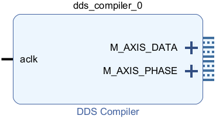

*AXIS* stands for *AXI Stream*, a protocol the block uses to transfer continuous "streams" of data. In an earlier project we met the [AXI GPIO](/Tutorials/PROJ_LEDAXI) protocol. *AXI* is a general-purpose connector, used by many blocks for their inputs and outputs.

* The input *aclk* is the clock signal. The '*a*' stands for *AXI*, since the clock is used to coordinate the *AXI* data transfers.
* The phase $\phi$ the DDS generates is sent out *M_AXIS_PHASE*.
* By default, the DDS outputs both a sine and cosine wave in *M_AXIS_DATA*. 

We'll need to customise the block to suit our project.

#### Output width

We need the *Output Width* to match the DAC input size. The way we do this depends on how the block is configured. If you *Right-click -> Customize Block*, by default *Configuration Options* is set to *Phase Generator and SIN COS LUT*. This means it outputs both the phase, and a combined sine/cosine signal.

At the bottom under the heading *System Parameters*, there is an option called *Spurious Free Dynamic Range (dB)*. This is the [ratio of the amplitudes of the frequency being generated, and that of the next harmonic](https://www.ni.com/ja-jp/support/documentation/supplemental/18/specifications-explained--spurious-free-dynamic-range--sfdr-.html). The larger this is, the 'purer' the signal being generated. As shown in Table 4-3 of the [DDS Manual](https://docs.xilinx.com/v/u/en-US/pg141-dds-compiler), the *Output Width* is equal to the *Spurious Free Dynamic Range* divided by six (rounded up to the nearest bit): 

$$\mathrm{Output\,width}=\frac{\mathrm{SFDR}}{6}$$.

If you change *Configuration Options* to *SIN COS LUT only*, the block takes a phase signal as input, and gives the waveform as output. In this configuration you specify both the *Output Width* and *Phase Width* to expect on the input. 

Since we want to generate a wave from a clock signal, we'll use the default *Phase Generator and SIN COS LUT*. To make the Output Width 14, set the *SFDR* to 6*14=84.

In the left of the *Customize block* dialog, you can see the block inputs and outputs. If you click the '+' after *M_AXIS_DATA*, you can see this is made up of two signals:

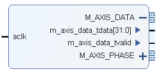

* A vector *m_axis_data_tdata* carries the sine and cosine wave. Each wave has 14 bits from the *Output Width*, sign expanded to be 16 bits. Combining these gives a 32 bit output.
* A wire *m_axis_data_tvalid* which is part of the *AXIS* protocol. Electrical signals take time to propagate through the FPGA, so the data coming out of the *tdata* port may not always be what it's meant to. Moreover, data needs to be sent out in sync with the clock signal. To help the receiving block coordinate this, the *tvalid* signal carries a single bit which is 1 if the data is valid, and 0 otherwise.

#### Other DDS settings

We need to tweak the DDS block a bit more. In the *Configuration* tab, set the *System Clock* to 125MHz to match our Pitaya:

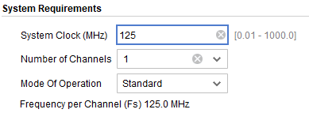

Then in the *Implementation* tab, you can uncheck the *Has Phase Out* tick box to remove the unnecessary *M_AXIS_PHASE* output. 

Under *Detailed Implementation*, check *Output TREADY*:

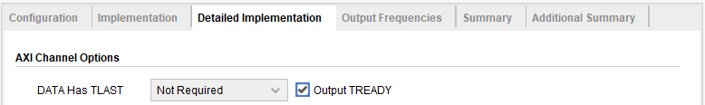

This adds an extra channel *m_axis_data_tready* under *M_AXIS_DATA*:

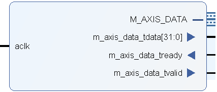

This is a third channel which is part of the *AXIS* protocol, where the block we connect the DDS to can send a signal saying whether or not it is ready to accept data. The block we will use to connect to the DAC has a *tready* channel, so we include it on the DDS to match.

Finally in the *Output Frequencies* tab, we can choose the frequencies of the generated output. This is up to you, we've left ours at the default 20kHz:

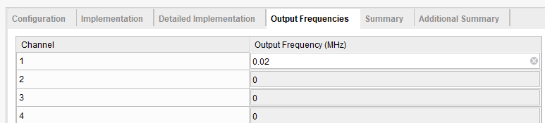

You can look through the *Summary* and *Additional Summary* tabs to make sure all the settings are correct. Then press *OK*, and connect *aclk* to the Processing Systems' *FCLK_CLK0*.

### Clocking wizard

To time the signals, the DAC needs to take both the system 125MHz clock, as well as a doubled 250MHz clock. We can use a *Clocking Wizard* block in Vivado to generate the doubled clock, see [here](https://electronics.stackexchange.com/questions/110134/how-to-double-my-clocks-frequency-using-digital-design) for some discussion on how this could be implemented physically.

Click *Add IP*, and choose *Clocking Wizard*:

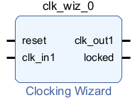

- We send in a clock signal through *clk_in1*, and receive our modified clock through *clk_out1*.
- Signals take time to change, and can fluctuate due to the finite travel time of electrical signals. When the output *locked* is set to one, it means that the clock signal can be trusted. We need this for the DAC.
- The *reset* input can be used to clear and restart the clock. We won't use this.

*Right-click -> Customize Block*. In the first tab *Clocking Options*, at the bottom set the *clk_1* input frequency to 125MHz to match the Pitaya's clock. You'll have to change the switch from *Auto* to *Manual*:

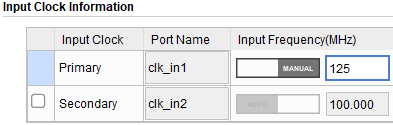

Next go to the *Output Clocks* tab. At the top set the *clk_out1* *Output Freq* to 250MHz:

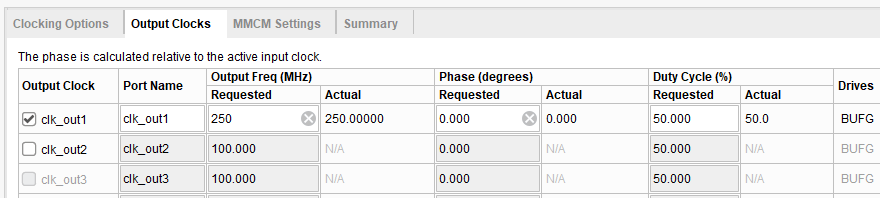

At the bottom under *Enable Optional Inputs/Outputs for MMCM/PLL*, you can turn off the *reset* input:

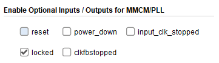

After you have finished, connect *clk_in1* to the Pitaya's *FCLK_CLK0*.

### AXIS DAC module

#### Add source

Finally we need to send the waveform to the Pitaya's DAC outputs. We will do this using [Pavel Denim's AXIS DAC v2](https://github.com/pavel-demin/red-pitaya-notes/blob/master/cores/axis_red_pitaya_dac_v2_0/axis_red_pitaya_dac.v). Eventually we recommend checking out the [details of how this works](/Tutorials/CORE_DAC_AXIS), but you can also just use it as a 'black box' for simple applications.

Download the file *axis_red_pitaya_dac.v* from this folder.

In Vivado on the left sidebar, select *Add Sources*, and choose *Add or create design sources*. Click on *Add Files*, add the *axis_red_pitaya_dac.v* file, and press finish. You should now have a new file under *Sources*:

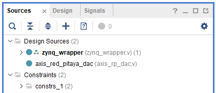

* In the picture above, *zynq_wrapper* is the source for our Block Design, which is blue because we have already run *Generate Output Products* and *Create HDL Wrapper*. If you haven't done this yet yours will be orange. It doesn't matter when you generate the wrapper, so long as you do it before generating the bitstream.
* If you have already generated the wrapper for your Block Design, the original block design (for us *zynq_wrapper*) should still be in bold, telling Verilog that this is the main project it should compile. If yours isn't, *Right-Click -> Set as Top*.
* If you haven't already generated the wrapper, then the *dac* will be in bold. Remember to set your main design as top once you generate the wrapper.

#### Adding the module

*Right-click* your Block Design, and choose *Add Module*. Select the *axis_red_pitaya_dac* module and press *OK*. Alternatively you can drag and drop it in from *Sources*.

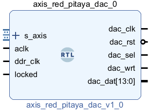

The *axis_red_pitaya_dac* block can be used to send any data to the DAC. With the default settings:

* The input data must be in the *AXI Stream* format.
* The DAC has a 14-bit output width, corresponding to the STEMLab-14.
* The input data comes as a 32 bit vector. The block assumes that this is divided into two 16-bit groups, one for each DAC, where the first 14 bits of of each group is sent to the DAC, and the other two bits ignored.
* Each 14 bit output is assumed to be a signed integer encoded in [two's complement binary](/Tutorials/FPGA_NegativeBinary). This is the default encoding for most of Vivado's IP.

To customise these settings you need to modify the [Verilog code for this block](/Tutorials/CORE_DAC_AXIS).

#### Connecting the ports

The inputs to this block accept the data to send to the DAC ports:

* *s_axis* accepts data in the *AXI Stream* format. If you click on the '+' to expand *s_axis*, you will see that it has ports which perfectly match the *M_AXIS_DATA* ports on the *DDS Compiler*. If you minimise both of these, you can just draw a single connection between the two and Vivado will automatically match the individual ports.
* *aclk* takes the Red Pitaya's 125MHz *FCLK*.
* *ddr_clk* and *wrt_clk* connect to the *Clocking Wizard*'s 250MHz *clk_out1*, and *locked* connect to the *locked* output..

The outputs all connect to the DAC pins. The most important one is:

* *dac_dat[13:0]* connects to *dac_dat_o[13:0]*, carrying the output data at Double Data Rate.

The rest just carry various other signals that are needed for the DAC to operate. We don't have to worry about what these are, see [the AXIS DAC writeup](/Tutorials/CORE_DAC_AXIS) if you want the details.

* *dac_clk* connects to *dac_clk_o*
* *dac_rst* connects to *dac_rst_o*
* *dac_sel* connects to *dac_sel_o*
* *dac_wrt* connects to *dac_wrt_o*

At this point your Block Design might be looking a bit messy. You can *Right click -> Regenerate Layout* and Vivado will try and arrange it neatly. You can also hold down *Ctrl*, select multiple blocks, then *Right Click -> Create Hierarchy* to group several blocks together.

Creating a Hierarchy for the blocks used in signal generation, we arrive at the final block design:

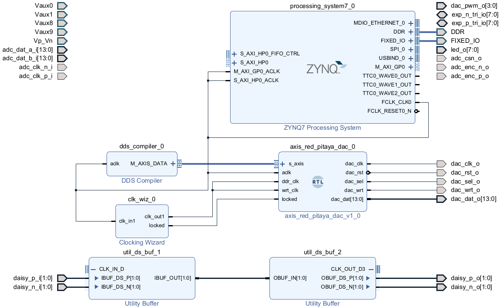

Generate a Bitstream and run this on the Pitaya. If you plug it into an oscilloscope, you should see sine and cosine waves coming out of the analog outputs.

## What's next?

You can now use the Red Pitaya as a signal generator! There are many ways that you could extend this, for example

* Play around with Vivado IPs and custom Verilog code to generate other signals, or arbitrary waveforms.
* Use [GPIO](/Tutorials/PROJ_LEDAXI) to set the frequency and amplitude.

* We created a Hierarchy for the signal generation blocks. As described in the [simulation tutorial](/Tutorials/PROJ_LEDSimulating), you can *Right click -> Create Block Design Container*, and make a Verilog testbench to simulate the output to the DACs.

If you want to learn more about Direct Digital Synthesis, see

* [All About Circuits - Everything you need to know about Direct Digital Synthesis](https://www.allaboutcircuits.com/technical-articles/direct-digital-synthesis/)
* For all the details you would need to rigorously characterise errors and performance, [Analog Devices has a 122 page tutorial](https://www.analog.com/media/en/training-seminars/tutorials/450968421DDS_Tutorial_rev12-2-99.pdf).
* The [official DDS Compiler documentation](https://docs.xilinx.com/v/u/en-US/pg141-dds-compiler).

To learn more about the DACs, you can see the data sheet for the [DAC1401D125 Digital to Analog converter](https://www.renesas.com/us/en/document/dst/dac1401d125-datasheet).
