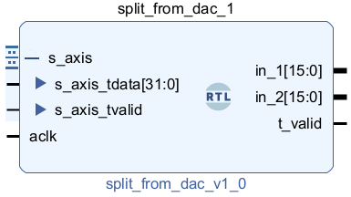
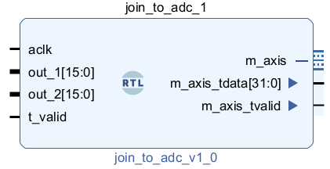
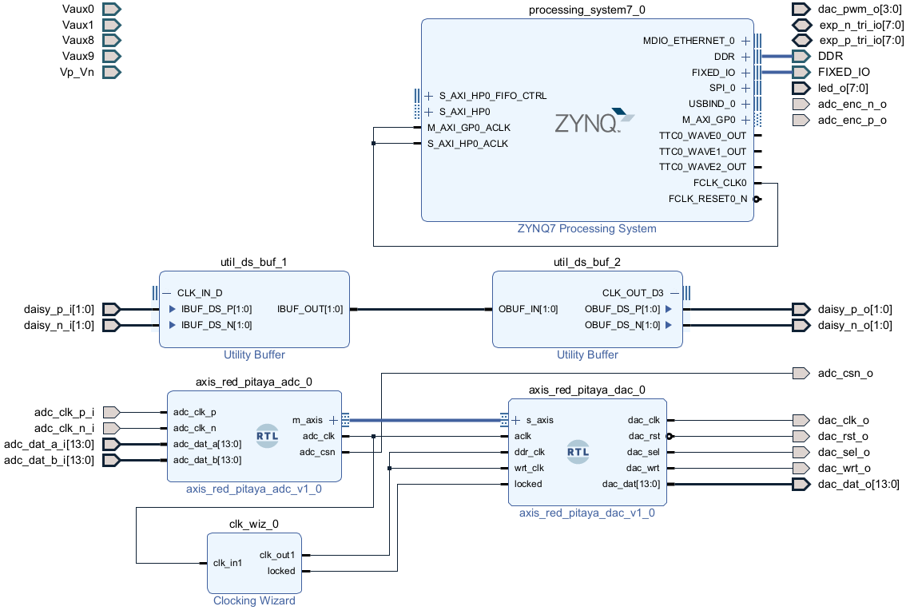
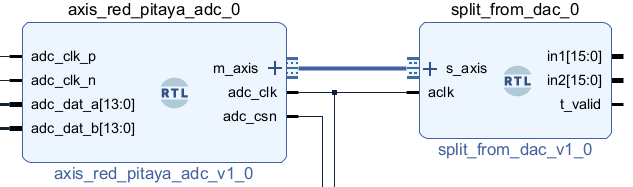
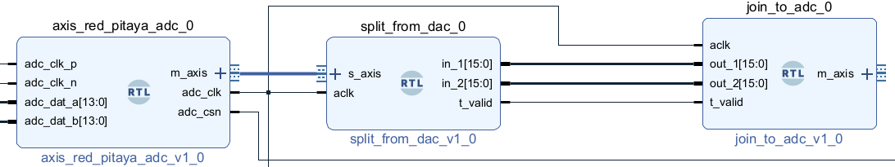
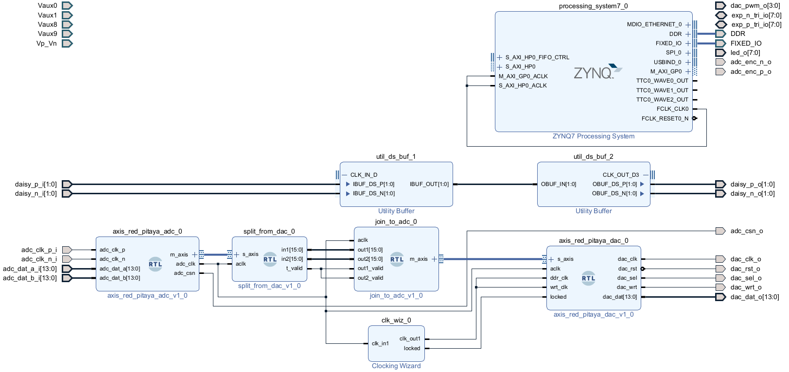

# Splitting and joining AXIS data

In the  [input signal feedthrough](/Tutorials/PROJ_IOFeedthrough) tutorial, we've seen how to take data from the Red Pitaya's analogue inputs, and then feed this to the outputs. The data is contained in a 32 bit AXI Stream which combines the the two signals. To do signal processing or feedback, we need to be able to manipulate the input signals individually. In this tutorial we'll introduce two Verilog blocks, one which splits the 32 bit stream from the ADC into the two 16 bit signals, and another which recombines them into a 32 bit signal to feed to the DAC.

The modules are described by two files `join_to_adc.v` and `split_from_dac.v` which you can download from this folder. If you want the details on how they work [see here](/Tutorials/CORE_SPLIT_JOIN), but you don't need to know this.

For the STEMLAB-14, the data coming from the ADCs is 14 bit. So why do the splitting and joining blocks work with 16 bits? There are two reasons for this. 

* Many Vivado blocks work with a whole number of bytes (for example the [DDS Compiler](/Tutorials/PROJ_IOSignalGeneration)), so we have to [sign extend](/Tutorials/FPGA_NegativeBinary) to 16 bits.

- Red Pitaya [also has a model](https://redpitaya.com/product/sdrlab-122-16-standard-kit/) with 16 bits on the ADC (though still only 14 bits on the DAC). Including the extra bits on our splitting and joining code mans you won't have to re-write them if you also want to run this code on the 16 bit model.

## Verilog blocks

Let's first introduce the two blocks.

### split_from_dac.v

This block splits the 32 bit signal from the DAC into two 16 bit streams.

This has two inputs:

* As *s_axis* AXI stream, made up of a 32 bit data line *s_axis_tdata*, and a *s_axis_tvalid* signal saying when the incoming data is valid. It is the *s_axis_tdata* signal that contains our combined input data.
* A clock signal *aclk*, short for 'AXI Clock'. This will be the 125MHz signal from the DAC.

There are three outputs:

*  *in1* and *in2* are 16 bit signals containing the two inputs. Recall that the STEMLab-14 has 14 bit ADCs, so the upper two bits on these will be padding.
* *t_valid* just feeds through *s_axis_tvalid*.

### join_to_adc.v

This block joins two data signals into a single AXI stream to give to the DAC.

There are four inputs:

* *aclk* is the AXI clock signal, which will be the 125MHz signal from the DAC.

* *out1* and *out2* are the two 16 bit signals that we want to send to the two output ports.

* We have two signals *out1_valid* and *out2_valid* which are either 0 or 1. When *out1_valid* is 1, the corresponding bits of of *m_axis_tdata* are updated with the current value of *out1*. When *out1_valid* is false, *m_axis_tdata* holds the old value of *out1*. Similarly for *out2_valid*.

  These are actually quite important, because while the input is sampled at 125MHz along with the clock signal, the output signals may have a lower sampling frequency. For example, we may have a filter processing one of the data streams which takes five clock cycles to work, and thus gives an output on every fifth clock cycle, with the data in-between these cycles being nonsense. Then we would send a *valid* signal only every fifth cycle.

## Block design

Begin by creating the block design from [input signal feedthrough](/Tutorials/PROJ_IOFeedthrough). Make sure you remember to *Generate Output Products* and *Create HDL Wrapper*, and then set the wrapper for your design as top. Next, delete the connection between *m_axis* on the ADC and *s_axis* on the DAC, leaving you with something like this:

### Add sources

On the left sidebar under *Project Manager* select *Add Sources*. Choose the *Add or create design sources* radio button and press *Next*. Then use the *Add Files* button to add  `join_to_adc.v` and `split_from_dac.v`. 

### Connect split_from_dac

Drag and drop *split_from_dac* into the block design. Connect its *s_axis* to the *m_axis* port on the ADC, and its clock signal *aclk* to *adc_clk*.

The ports *in1* and *in2* carry the signals for the two inputs on the Red Pitya. The *t_valid* signal passes through the *m_axis_t_valid* signal which is contained in the *m_axis* output. In later tutorials we will use these to do filtering on the individual inputs, but for now we'll just recombine them and send them to the DAC.

### Connect join_to_adc

Drag *join_to_adc* into the design. Connect its *out1* and *out2* ports to *in1* and *in2* on the splitting block. Connect *t_valid* to both *out1_valid* and *out2_valid*, and connect *aclk* to the *adc_clk* on the ADC.

Finally, connect the *m_axis* port on *join_to_adc* to the *s_axis* port on *axis_red_pitaya_dac*, giving you the final design:

This design should just pass input straight through to the outputs. Compile it and check if it works! 

## What's next?

- At the moment this circuit doesn't do anything more than the  [input signal feedthrough tutorial](/Tutorials/PROJ_IOFeedthrough). But now that we can split the input channels, we can start doing some [signal processing](/Tutorials/FILTER_SimpleFIR)!