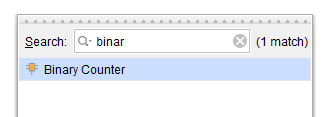
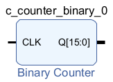

# LED Binary counter

The Red Pitaya has a series of LEDs on the side, which you can use to signal basic information. A good first project is to make these flash. In this tutorial we'll see how to turn them into a simple binary counter. This is based on [Anton Potočnick's LED Blinker tutorial](http://antonpotocnik.com/?p=487360).

The blocks in Vivado represent basic elements which communicate with each other in binary. Thus programming an FPGA requires a basic understanding of how binary works. You don't need to know how to program in 1s and 0s, since Vivado already has premade blocks that do the processing for you. You just need to manage how these talk to each other, and communicate with the ports. We'll introduce the required bits of binary as we go.


## Preliminaries

### Clock signals

Most digital circuits need a clock signal, which oscillates between 0 and 1 at a predetermined rate. This is a useful resource if you want to, for example, make some LED lights blink. It is also important for synchronisation. The diagram in Vivado represents a physical circuit, and it will take electric signals different amounts of time to travel through the various connections. Circuit elements can wait one clock cycle in between processing, giving the signals time to catch up.

### Binary counters

The clock signal is too fast to drive the LEDs directly, so we have to slow it down. The simplest way to do this is with a *binary counter*. Lots of great expositions come up if you search "How to count in Binary", so we'll just give a brief overview here. 

Our regular number system is base ten. This means that we have ten digits which we count with:

0, 1, 2, 3, 4, 5, 6, 7, 8, 9

This lets us count from zero to nine. To count beyond this, we add an extra digit and repeat the process:

10, 11, 12, 13, 14, 15, 16, 17, 18, 19

When we run out of digits, we increment the first digit from 1 to 2. Eventually we'll reach 99. At this point we add a third digit:

98, 99, 100, 101, 102

and so on.

The *binary* system is base two. This means we have two digits which we count with:

0, 1

This lets us count from zero to one. To count beyond this, we add an extra digit and repeat the process:

10, 11

Since we only have two digits to play with, at this step we have to add a third digit. The process then continues.

Let's look at how you count in Binary from zero to eight:

```0, 1, 2 , 3 , 4  , 5  , 6  , 7  , 8```

```0, 1, 10, 11, 100, 101, 110, 111, 1000```

The numbers are the same if we add leading zeros:

```0000, 0001, 0002, 0003, 0004, 0005, 0006, 0007, 0008```

```0000, 0001, 0010, 0011, 0100, 0101, 0110, 0111, 1000```

The last row of four 0/1 digits is a *four-bit binary counter*. We could imagine them as four LEDs which are on/off to represent the digits 0/1. 

Suppose the binary counter ticks forward at a rate of one number per second.

* The rightmost digit oscillates between 0 and 1 at a rate of $1\mathrm{Hz}$, or equivalently $(1/2^0)\mathrm{Hz}$.
* The next digit from the right will oscillate between 0 and 1 at half this rate, i.e. $0.5\mathrm{Hz}$, or $(1/2^1)\mathrm{Hz}$.
* The third digit from the right will be $(1/2^2)\mathrm{Hz}$, 
* and the fourth will be $(1/2^3)\mathrm{Hz}$.

So if a binary counter is ticking forward at some rate $r\mathrm{Hz}$, the $n$ th digit from the right will oscillate between 0 and 1 at a rate of $(r/2^{n-1})\mathrm{Hz}$. 

**So to slow down a clock signal by $2^n$, we can use it to drive an $n+1$-bit binary counter, and then take the left-most digit.**

# Procedure

The *FCLK_CLK0* output on the *ZYNQ7* provides a binary signal which oscillates between 0 and 1 at a rate of 125MHz. We will feed the clock to a binary counter, take the leftmost digits, and use these to switch the LEDs on and off.

To start with, follow our [Base Vivado design tutorial](/Tutorials/SETUP_BaseCode/README.md) for the initial setup.


## 1. Add a binary counter

To add a pre-made binary clock, press the plus-shaped button to *Add IP*:


Alternatively you can *Right-click -> Add IP*, or press *Ctrl + I*. 

Use the Search box to find a *Binary Counter*, which you can select by double clicking, or pressing the Enter key.



This should add a Binary Counter block to your design:



This has one input and one output:

* On the left, *CLK* signifies that this takes a clock signal.
* On the right it outputs a vector *Q* with sixteen bits, indexed from 15 to 0. It is typical for the 0th index to refer to the right-most component of the vector, rather than the left-most as in programming languages such as Python. To see why, look back at the binary counter. The right-most bit refers to the $2^0$ component, the next right-most to the $2^1$, and so on. So by indexing vectors from the right, the vector element $k$ represents the $2^k$ component.

The *FCLK_CLK0* on the ZYNQ7 processing system produces a signal oscillating at 125MHz, or $1.25\times 10^{8}$ times per second. Suppose we want to slow this down to two cycles per second. How many bits do we need in our counter?

$$\frac{1.25\times 10^8}{2^k}=\frac{1}{2},$$

$$\log(2^k)=\log(1.25\times 10^8)-\log(1/2),$$

$$k=\frac{\log(1.25\times 10^8)-\log(1/2)}{\log 2}=27.9.$$

Our binary counter thus needs to be around 28 bits long.

## 2. Slice the output