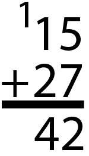
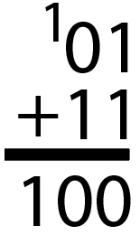

# LED Binary counter with Verilog

In the [LED binary counter](/Tutorials/PROJ_LEDCounter) tutorial, we made our design by dragging and dropping pre-made blocks in Vivado. Often we will want to create our own blocks, which is done by writing code in *Verilog*. In this tutorial we'll use Verilog to implement the binary counter.

Verilog is a [Hardware Description Language](https://electronics.stackexchange.com/a/601671). Rather than telling a processor to do things, the code you write specifies a physical circuit that you want the FPGA to reproduce. If you want to learn Verilog, check out the [Further reading](/References). We'll try and describe here the bare minimum you need to understand the design.

## Designing a binary counter

In this section we'll design an eight-bit *Ripple Carry Adder*. 

### Algorithm for addition

In this section we'll slowly build up a Verilog representation of a binary counter. A counter is an adder, which repeatedly adds the number one to it's current total. Thus along the way, we will learn a little bit of binary arithmetic.

Let's look at the usual algorithm for adding two numbers, such as 15+27=42:



First we add 5+7 to get 12. We write the 2 in the first column, while the 1 is carried to the second column. We then add the numbers in the second column, plus the carry, to make 1+2+1=4.

The addition algorithm thus works by adding together single-digit numbers, starting from the right-most digit. If the result is a two-digit number, the new digit is carried over to the next addition.

If you think about it, nothing in this addition algorithm relies on the fact that we are worked in base ten. In fact, we can use exactly the same algorithm in base two. If we wanted to add 1+3=4, this would look like:



We can therefore construct an adder for eight-bit numbers, by combining eight one-bit adders. 

### Single-bit ripple carry adder

Let's think about the circuit for adding two bits together. This has 

* Three inputs: the two bits to add, as well as any carry given by the previous addition.
* Two outputs: The sum of the bits, and the carry to pass to the next addition.

These are related by:

| Input Bit One | Input Bit Two | Input Carry | Sum  | Output Bit | Output Carry |
| ------------- | ------------- | ----------- | ---- | ---------- | ------------ |
| 1             | 1             | 1           | 11   | 1          | 1            |
| 1             | 1             | 0           | 10   | 0          | 1            |
| 1             | 0             | 1           | 10   | 0          | 1            |
| 1             | 0             | 0           | 1    | 1          | 0            |
| 0             | 1             | 1           | 10   | 0          | 1            |
| 0             | 1             | 0           | 1    | 1          | 0            |
| 0             | 0             | 1           | 1    | 1          | 0            |
| 0             | 0             | 0           | 0    | 0          | 0            |

It's worth spending a bit of time trying to generate this table yourself. 

A one-bit Ripple Carry Adder is any circuit that maps three input bits to two output bits following the rules above. If you spent a bit of time, you could figure out how to build this out of basic logic gates. In Verilog we will do this with a `case` statement:

```verilog
case(input)
	3'b111 : out = 2'b11;
    3'b110 : out = 2'b01;
    3'b101 : out = 2'b01;
    3'b100 : out = 2'b10;
    3'b011 : out = 2'b01;
    3'b010 : out = 2'b10;
    3'b001 : out = 2'b10;
    3'b000 : out = 2'b00;
endcase
```

The notation `3'b101` means a *three-bit binary with value 101*. The `case` statement compares the value of a variable called `input` to each of the lines. Depending on which line it matches, the variable called `output` is given a value. When we compile the circuit, Vivado will convert this code to a logical circuit on the FPGA.

## Design

## Conclusion

If you want more details than what we give here, there are many excellent explanations o 

see section 12.3 of [LaMeres - Introduction to Logic Circuits & Logic Design with Verilog](https://www.amazon.com/Introduction-Logic-Circuits-Design-Verilog/dp/3319852655).