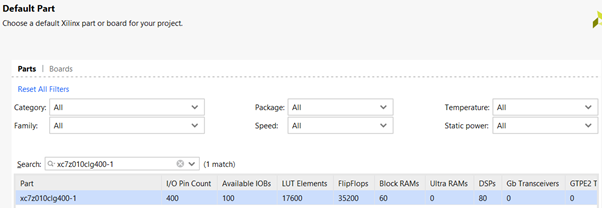
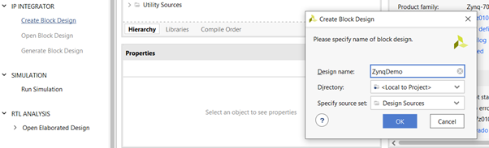
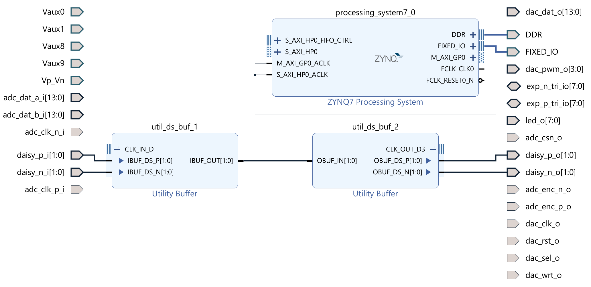
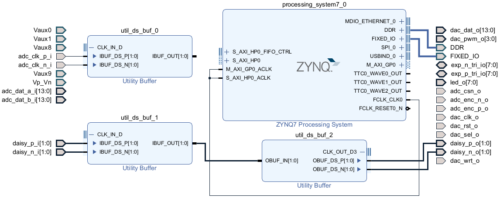

# Base Vivado design

Here we'll describe how to make a model of the Red Pitaya in Vivado. All of the projects we describe will begin from this base setup.

For this to work, you need to tell Vivado all the physical details of the Pitaya, such as the parameters of all its input and output pins, and how the FPGA logic communicates with the CPU. This is quite laborious, but fortunately [Anton Potočnik](http://antonpotocnik.com/) has written [some great scripts](https://github.com/apotocnik/redpitaya_guide) that automate the process. We will be using modified versions of these, which you can download from the folder containing this tutorial:

* *rp_base_setup.tcl*
* *red_pitaya.xml*
* *ports.xdc* and *clocks.xdc*

## Procedure

### 1. Create a Vivado project with the right settings

Open Vivado, and create a *New Project*. There will be a few windows where you can choose a name and folder for the project. Use the default project type *RTL Project*, and tick *Do not specify sources at this time*.

When it asks you to choose the part, give **xc7z010clg400-1**:



Now press *Create Block Design*, under *IP INTEGRATOR* on the left sidebar.



Choose whatever Design name you like, and leave the other options as default.

This should leave you with a blank design to work on.

### 2. Create base setup

We need to give Vivado a list of the input/output ports on the Pitaya, tell it about the CPU, and how all these are interconnected. All this information is contained in the *rp_base_setup.tcl* file.  In the Tcl console, navigate to the folder containing the script (see [the tutorial on running Tcl scripts](/Tutorials/TCL_RunningTCL/README.md) for how to do this), and run 

```source rp_base_setup.tcl```

After doing this a basic setup should appear in the *Diagram* window:



Let's run through what the these components are:

* On the the left- and right-hand sides we have input and output ports respectively. The inputs marked *adc* carry signals from the Analog to Digital converters, and you can send output to the *dac* Digital to Analog converters. Some ports are bi-directional, indicated by having points on both sides.
* The *ZYNQ7 Processing System* is the CPU, which itself has input and output ports on the left and right.
* The *daisy_* ports are used to connect multiple Red Pitaya's together. Data needs to flow in a specified way between them, which is handled by the two Utility Buffers *utils_ds_buf_1* and *util_ds_buf_2*. Even if you don't plan on connecting multiple Pitayas, the design won't compile without these, so leave them in.

### 3. Final configuration

Now we'll give Vivado the last information it needs about the Red Pitaya.

First, right-click the *ZYNQ7 Processing System* and select *Customize Block*. Click on *Import XPS Settings* at the top, press the '...' button, and choose the *red_pitaya.xml* file. Press *OK* and then *OK* again to get back to the design, and you should see some extra ports appear on the *ZYNQ7* block:



Finally we need to tell Vivado some information called the *constraints*. These contain information such as the exact voltages for each port, if you want more details see [this post](https://support.xilinx.com/s/article/564948?language=en_US). On the sidebar on the left, click on *Add Sources*, and choose *Add or create constraints*. Use the *Add Files* button to add both *ports.xdc* and *clocks.xdc*, the press *Finish*.

## What next?

You now have a Red Pitaya set up in Vivado! The next step is to play around with it. See our [LED binary counter](/Tutorials/PROJ_LEDCounter) for a good first step.

### Further reading

When we created the project, we ticked *do not specify sources at this time*. By *sources* Vivado means the constraints files which we added later, as well as custom code blocks that you've written. It makes no difference whether you add these all at the start, or later on.

The part number was *xc7z010clg400-1*. You don't have to know what the letters mean, but if you're curious:

* the underlying chip is an *xc7z010*,

* in a *cfg400* package, 
* binned into a *-1* speed grade (the slowest option, *-3* is the fastest).
