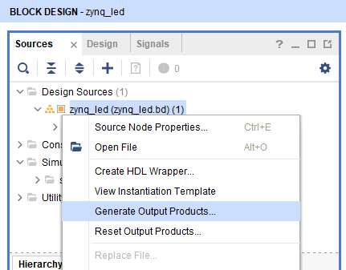
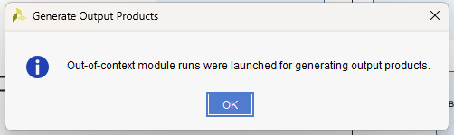
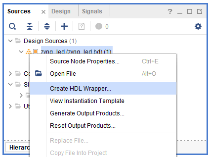
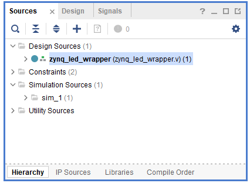
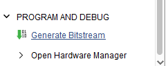
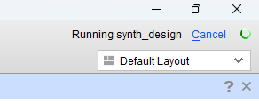
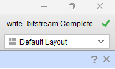

# Compiling and running code on the Pitaya

In this tutorial we will look at how to compile a design in Vivado into binary code which you can run on your device.

# Procedure

Begin by making a design in Vivado, such as our [LED Binary Counter](/Tutorials/PROJ_LEDCounter/README.md).

## 1. Generate output products & wrapper

We need to give the compiler some information about turning our block design into bits. Note that you will only have to do this step once. If you change your design and want to recompile, Verilog will automatically manage this step.

We first need to convert our block design into something that can be compiled into bits. Under *Design Sources*, right-click your *Board Design* and select *Generate Output Products*:



Leave everything as default. You should see *Synthesis Options* is set to *Out of context per IP*. This means that if you later change the design and recompile, Vivado will be clever and only compile the bits you changed, saving time. When it finishes, you'll get a dialog box about "Out-of-context module runs", just click *OK*:



Now right-click again and choose *Generate HDL Wrapper*:



You should now have a new wrapper file ending in `.v`. Your constraints file contained information on how the ports in the block diagram corresponded to the physical pins on the Red Pitaya. This new file converts this information into a format the compiler can understand.



## 2. Generate Bitstream

We are now ready to convert our design into ones and zeros! Click on *Generate Bitstream* button on the bottom of the left sidebar:



**It may not look like anything is happening, because the progress indicator in Vivado is tucked away in the upper-right.** There is a little status indicator, which lets you know that the compiler is running. 



Wait until this finishes:



You will get a dialog box saying *Bitstream Generation successfully completed*. If you click *OK* it will open up a low-level view of the device, you can get back to where you were by clicking *Open Block Design* on the left sidebar.

## 3. Running on the Pitaya

Now we need to find the compiled code, which is hidden away inside our project folder. Go to the folder where you saved your project, then open *[project_name].runs*, where *[project_name]* is the name of your project. This should have a subfolder called *impl_1*, containing lots of files. One of these will end in `.bit`, this is what you want. The filename should be the same as the wrapper you generated in step 2.

Turn on the Red Pitaya, and use *SCP* to copy the *.bit* file from your computer to the Pitaya:

```scp zynq_led_wrapper.bit root@rp-XXXXXX.local:~```

though the name of the `.bit` file and address of the Red Pitaya will be different in your case, and we have chosen to copy the file to the `~` directory. It will ask you for the password, which should be `root` by default.

Now SSH into the Pitaya:

`ssh root@rp-XXXXXX.local`

Again you will have to enter the `root` password.

Now move to the `~` directory:

`cd ~`

If you run `ls`, you should see your `.bit` file there. To make the Pitaya run your compiled code, run

```cat zynq_led_wrapper.bit > /dev/xdevcfg```

where again the name of your `.bit` file may differ. This will make the Pitaya execute your design! You haven't done anything permanent though, and restarting the device will send it back to normal operation.

# What next?

You now know how to compile and run FPGA code for the Red Pitaya! Check out some of our projects.

If you tinker with your project and re-compile, you don't have to worry about step 1.. The HDL wrapper will automatically update, so all you need to do is generate the bitstream.