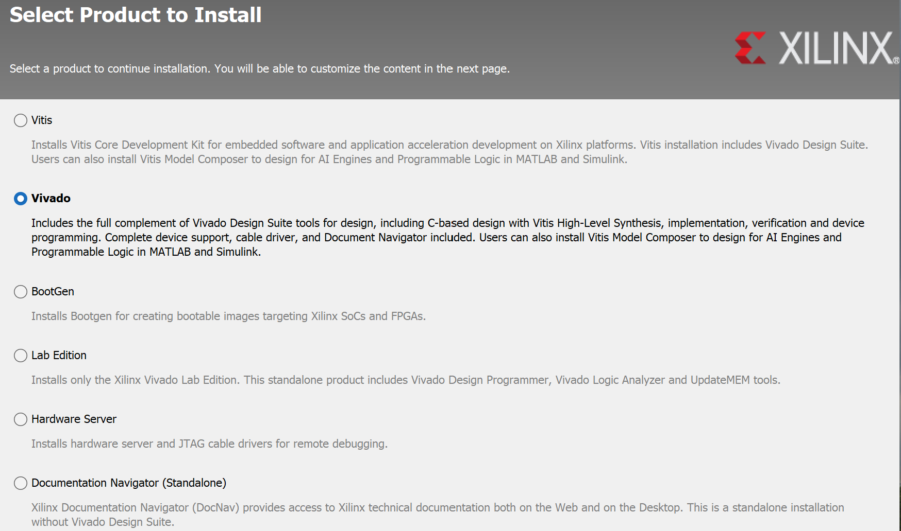
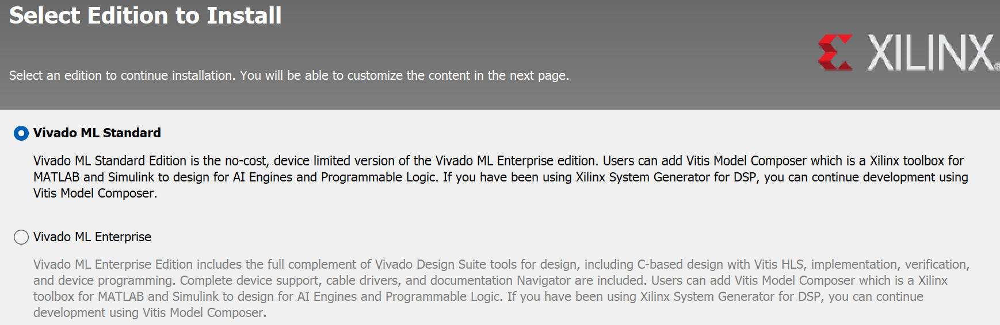

# Installing Vivado

Vivado can be downloaded on [this page](https://www.xilinx.com/support/download.html).

You have to first create an account with Xilinx. As part of this you need to fill in a lot of details including your name, address, and field of research, since apparently Vivado falls under US export controls.

Below are the installation options that come up when running the *Xilinx Unified Installer 2022.2* on Windows 11. The procedure on Linux should be similar.

Beware that the installation procedure can require a lot of space. To install Vivado 2022.2 on Windows 11, it took an 18GB download, 65GB during install, with a final disk usage of 32GB.

## Installation options

When it asks you which product to install, choose *Vivado* (not *Vitis*, which is the default):

For the edition pick *Vivado Standard* (not *ML Enterprise*, which is the default):

Leave other options as default, accept the licence agreements, and install. 

The installer will then download and install Vivado.