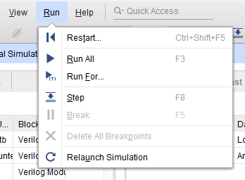

# Simulating binary counters in Vivado

In this example we'll see how to run simulations in Vivado. Rather than having to compile the entire design, simulations can let us see how particular blocks behave, and monitor what signals they are sending to each other. We'll consider as examples the [LED binary counter](/Tutorials/PROJ_LEDCounter) and the [Verilog version](/Tutorials/PROJ_LEDCounterVerilog).

It is possible to [simulate the entire ZYNQ7 CPU](https://www.xilinx.com/video/soc/how-to-use-the-zynq-7000-verification-ip-verify-debug-simulation.html). However, this is both complicated, and will take a long time to run, given the complexity of the processing system. Instead it makes more sense to generate simple test signals, such as an oscillating clock, and feed these to the blocks we care about. We create what's called a [testbench](https://nandland.com/what-is-a-testbench/), and use this to test a few blocks at a time.

## Procedure

### Create a testbench & set it as top

We'll first create a Verilog file that will be our *testbench*. It will generate a clock signal, feed it to some blocks, and monitor the output.

On the left sidebar choose *Add Sources*, and choose the *Add or create simulation sources* radio button. Create a new file and give it a name, in our case `counter_tb`. Leave all the ports and options as default, ignoring Vivado's warning, since we'll define them manually using Verilog.

After a short delay, you should see your testbench file appear in the *Simulation Sources* folder of the *Sources* tab:


Since we want the testbench to be in charge, *Right-click* it and select *Set as Top*. The testbench file should become bold.

### Write the testbench

Double-click the testbench file to edit it. You should see the standard Verilog module code from the [Verilog binary counter](/Tutorials/PROJ_BinaryCounterVerilog).

At the top you should see the code setting our timescale:

```verilog
`timescale 1ns / 1ps
```

As discussed in the [LED binary counter tutorial](/Tutorials/PROJ_LEDCounter) ([and in more detail here](https://www.chipverify.com/verilog/verilog-timescale)), this tells Verilog that the module will be in units of nanoseconds, with picosecond accuracy.

#### Ports

We want our testbench to send in a binary signal representing the clock. This needs to remember its value in-between ticks, so it will be a *register*:

``` verilog
reg clock;
```

For the output however, we just care about the instantaneous value coming out of our blocks. This will thus be a *wire*, a variable which holds no data, but rather gives the instantaneous value of whatever we connect it to.

```verilog
wire [7:0] counter_out;
```

#### Clock signal

We can make the clock tick with the following code:

```verilog
initial 
begin
	clock = 0;
    forever #1 clock = ~clock;
end
```

* An `initial` block executes once at the beginning of the simulation. It is bounded by `begin` and `end` statements.
* The value of `clock` will be set to an initial value of 0.
* A `forever`  statement executes continuously for the entire simulation. If you have several lines of code, you can also bound it with `begin` and `end` statements.
* `#1` means to wait for one unit of time, which due to `timescale` is one nanosecond.
* `~` is the logical *not* operator.

Thus at the start of the simulation, this block will set the clock equal to 0, and then flip its value between 0 and 1 every nanosecond.

### Connecting the testbench to a block

We can use this testbench to test either of the LED binary counter setups. We'll detail each of the possible connections:

#### Verilog binary counter

Let's connect our testbench to the [Verilog  binary counter](/Tutorials/PROJ_LEDCounterVerilog). First you need the name of the module that generated the signal, in our case `binarycounter`. The code is then

```verilog
binarycounter bc (.clk(clock),
                  .count(counter_out));
```

* This creates a new `binarycounter` object, and names it `bc` (the name is arbitrary).
* The `clk` port on `binarycounter` is connected to our `clock` register.
* The `count` port on `binarycounter` is connected to our `counter_out` wire.

In previous tutorials we drew connections between components by clicking and dragging with the mouse in the Design view. This does exactly the same thing, just in script form.

The module is then:

```verilog
module counter_tb();
	reg clock;
    wire [7:0] counter_out;
    
    initial begin
    	clock = 0;
        forever #1 clock = ~clock;
    end
    
    binarycounter bc (.clk(clock),
                      .count(counter_out));
endmodule
```

**If we just simulate this however, we won't see any output.** Recall that we used a binary counter to slow down the output by a factor of $2^{24}$, thus we will need to simulate $2^24\approx 10^7$ clock cycles just to see the first output on our counter.  This would take far too long. Thus for the purposes of simulation, go back to the `binarycounter` module, and change the last line to

```verilog
//assign count = count32[31:24] Commented out for simulation
assign count = count32[7:0]
```

Remember to undo this when you have finished simulating, or next time you synthesis your counter will run at light speed!

#### Block-design binary counter

This case is much the same, except that we have to create both of Vivado's binary counter and slice blocks, and then connect these together.

### Running the simulation

In the sidebar on the left, under *SIMULATION* click on *Run Simulation*, then select *Run Behavioural Simulation*. At first you might get something that looks like this:


* Use the scrollbar at the bottom to move to the very start of the simulation.
* Click the arrow next to *counter_out[7:0]* to expand it, so that you can see the individual bits.
* You should see that the time increment is picoseconds. Use the zoom button to zoom out until it is in nanoseconds, and you can see the clock switching on and off. Alternative you can press the *Zoom fit* button (*Ctrl + 0*)to the right of the magnifying glass to zoom out and see the entire simulation.
* Double click at a point to summon the yellow cursor to that point, telling you the exact time.
* You can also click and drag horizontally, vertically, or diagonally to change the region you are zoomed in on.

After this your screen should look something like below:


This shows the counter is working perfectly!

If you want to change the simulation length, you can click on *Run* on the top menu bar and choose *Run For*:



## What next?

In future projects, think about creating testbenches that will let you view important pieces of information. And bear in mind how you may have to modify your files for simulation.

In practice you may want to simulate more complex situations, for example taking data with the analog-to-digital converters. Vivado's simulator is quite capable, see the [official documentation](https://www.xilinx.com/content/dam/xilinx/support/documents/sw_manuals/xilinx2022_1/ug937-vivado-design-suite-simulation-tutorial.pdf) for more information.
